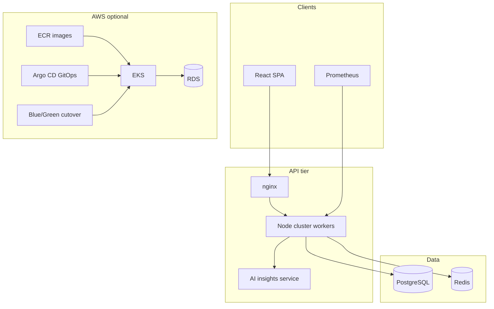

# Enterprise Advanced App

A **portfolio-grade** full-stack project for backend, full-stack, and platform engineering roles: production patterns recruiters and hiring managers look for in 2025–2026.

## Why this project stands out

| Area | What you can demo |
|------|-------------------|
| **Backend** | Node cluster, Worker Threads, advanced PostgreSQL, Redis cache, transactional orders |
| **Advanced patterns** | Correlation IDs, circuit breaker, domain events, idempotency, optimistic locking |
| **Security** | JWT + refresh token rotation, RBAC, Helmet, rate limits, CI audit |
| **AI** | Business insights API grounded in live data (OpenAI or demo mode) |
| **Observability** | Prometheus `/metrics`, structured logging (Pino), health probes |
| **API** | OpenAPI 3.1 generated from Zod + Swagger UI at `/api/docs` |
| **Commerce** | Product CRUD, order place/cancel with stock restore, pagination |
| **Security** | Register, JWT refresh rotation, audit trail API |
| **Quality** | Vitest + Supertest integration tests, ESLint, TypeScript strict |
| **Platform** | Docker, Kubernetes, Terraform (EKS/RDS), Argo CD GitOps, blue/green + auto-rollback |

**10-minute live demo:** [docs/DEMO.md](docs/DEMO.md)

## Quick start

### With Docker (recommended)

```bash
cp .env.example .env
docker compose up --build -d
docker compose exec backend npm run db:migrate -w backend
docker compose exec backend npm run db:seed -w backend
```

| URL | Purpose |
|-----|---------|
| http://localhost:8081 | React UI |
| http://localhost:3000/health | Readiness |
| http://localhost:3000/metrics | Prometheus metrics |
| http://localhost:3000/api/docs | Swagger UI |

**Login:** `admin@enterprise.local` / `Password123!`

### Local development

```bash
docker compose up postgres redis -d
npm install
npm run db:migrate && npm run db:seed
npm run dev
```

### Quality gates

```bash
npm run test        # API integration tests (Vitest + Supertest)
npm run lint        # ESLint (backend)
npm run typecheck   # TypeScript
npm run build       # Production build
```

## Architecture (high level)



## Project structure

```
├── backend/          # Express API — cluster, JWT, AI, metrics, OpenAPI
├── frontend/         # React + Vite — dashboard, AI assistant, RBAC UI
├── database/init/    # SQL schema + migrations
├── k8s/              # Kustomize + Argo CD + blue/green overlays
├── terraform/        # AWS VPC, EKS, RDS, ElastiCache, ECR, Lambda
├── lambda/           # Document upload (API Gateway → Lambda → S3)
├── scripts/          # Deploy, GitOps, blue/green automation
└── docs/             # Architecture, CI/CD, AWS, demo script
```

## Features

| Area | Features |
|------|----------|
| **Node.js** | Cluster mode, Worker Threads, graceful shutdown, Pino logging |
| **PostgreSQL** | CTEs, window functions, JSONB, trigram search, transactions |
| **Security** | Access + refresh JWT rotation, register, RBAC, Helmet, rate limiting, Zod, audit trail |
| **AI** | `/api/ai/insights` — LLM or demo mode from live analytics |
| **Commerce** | Product CRUD, paginated catalog, order cancel + stock restore |
| **Observability** | `/metrics` (Prometheus), `/health/live`, `/health/ready` |
| **Frontend** | Typed API client, role-based nav, AI Assistant page |
| **Kubernetes** | HPA, PDB, NetworkPolicy, Ingress, migrate Jobs |
| **CI/CD** | Tests, lint, audit, Docker, Kustomize, Terraform validate |
| **AWS** | EKS, RDS, ElastiCache, ECR, Argo GitOps blue/green |

## CI/CD

| Workflow | Trigger | Purpose |
|----------|---------|---------|
| [CI](.github/workflows/ci.yml) | PR / push | Build, **tests**, lint, migrations, Docker, Kustomize, Terraform |
| [CD](.github/workflows/cd.yml) | `main` / tags | GHCR + ECR, K8s / AWS / Argo GitOps deploy |

Details: [docs/CI_CD.md](docs/CI_CD.md)

## Documentation

- **[Features explained (start here)](docs/FEATURES.md)** — what each feature does and how to demo it
- **[Interview explanation (practice out loud)](docs/INTERVIEW_EXPLANATION.md)** — what to say for architecture, security, DevOps, AI
- **[Hiring: Principal / Architect / DevOps](docs/HIRING_PRINCIPAL_ARCHITECT_DEVOPS.md)** — stack matrix + interview demos
- **[Security development (latest)](docs/SECURITY_DEVELOPMENT.md)** — MFA, SSRF, DevSecOps CI, OWASP map
- **[Learn AI & ML (detailed)](docs/LEARN_AI_ML.md)** — beginner guide to AI assistant + from-scratch ML lab
- **[Demo script for interviews](docs/DEMO.md)**
- [Advanced concepts (patterns map)](docs/ADVANCED_CONCEPTS.md)
- [OpenAPI / Swagger (Zod-generated)](docs/OPENAPI.md)
- [Security practices](docs/SECURITY.md)
- [Architecture overview](docs/ARCHITECTURE.md)
- [Blue/green deployment](docs/BLUE_GREEN.md)
- [Argo CD GitOps](docs/ARGOCD.md)
- [AWS deployment](docs/AWS_DEPLOYMENT.md)
- [API reference](docs/API.md)
- [CI/CD pipeline](docs/CI_CD.md)

## Scripts

| Command | Description |
|---------|-------------|
| `npm run dev` | Backend cluster + frontend dev server |
| `npm run test` | API integration tests |
| `npm run lint` | ESLint |
| `npm run build` | Build both workspaces |
| `npm run docker:up` | Full stack in Docker |
| `npm run k8s:deploy` | Deploy local Kubernetes overlay |
| `npm run argocd:aws:blue-green` | Argo CD blue/green on AWS |

## License

MIT — use freely for learning and portfolio.
