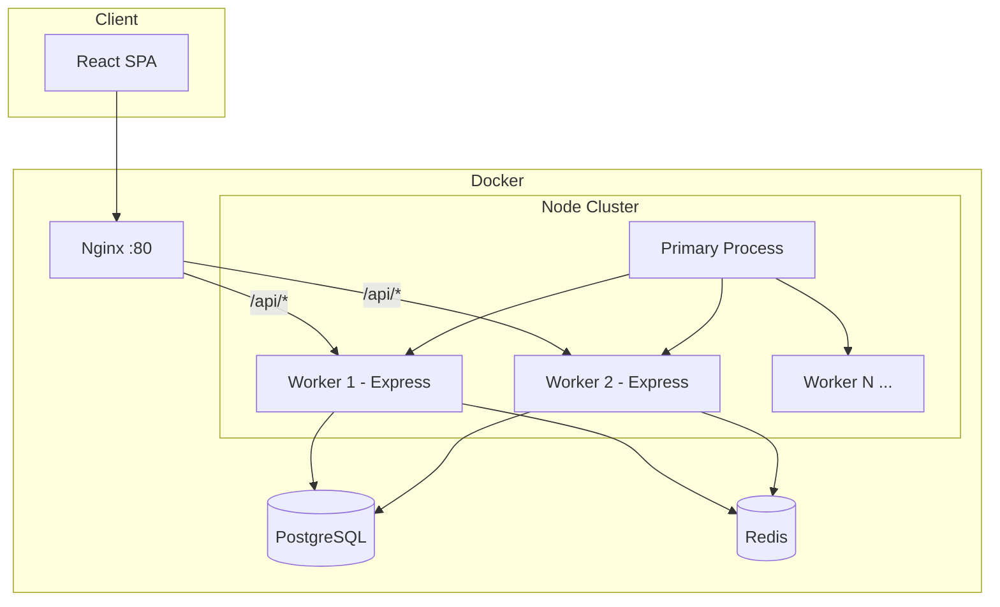

# Architecture Overview

## High-level diagram



## Layered backend design

```
HTTP Request
    → Middleware (helmet, cors, rate-limit, auth)
    → Routes (controllers)
    → Services (business logic)
    → Repositories / Queries (data access)
    → PostgreSQL / Redis
```

### Why layers matter

- **Routes** only parse HTTP and call services.
- **Services** hold auth rules and orchestration.
- **Repositories** encapsulate SQL — advanced queries live in `queries/`.
- **Workers** handle CPU work without blocking the event loop.

## Process model

1. **Primary process** (`cluster/primary.ts`) — does not serve HTTP. Forks N workers (default: CPU count).
2. **Worker processes** (`server.ts`) — each runs Express on the same port; the OS/kernel distributes connections.
3. **Worker Threads** (`workers/cpu-intensive.worker.ts`) — separate V8 isolates for CPU-bound tasks inside a worker process.

## Frontend architecture

- **Vite** for fast dev and optimized builds.
- **React Router** for SPA navigation.
- **AuthContext** stores JWT + user; permissions use TypeScript mapped types.
- **Generic API client** ensures typed responses end-to-end.

## Security

- Passwords hashed with **bcrypt**
- **JWT** for stateless API auth
- **Helmet** security headers
- **Rate limiting** on all routes
- Role-based access: `admin`, `manager`, `customer`

## Scalability notes

- Scale **horizontally** by running more backend containers behind a load balancer.
- **PostgreSQL** connection pool per worker — tune `DB_POOL_MAX` × worker count to avoid exhausting DB connections.
- **Redis** optional — app works without it (cache misses only).
