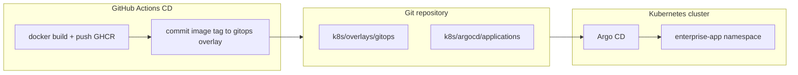
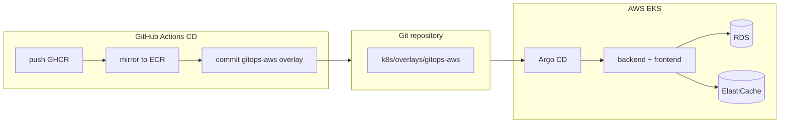

# Argo CD GitOps Deployment

[Argo CD](https://argo-cd.readthedocs.io/) watches Git and syncs Kubernetes state automatically — **Git is the source of truth**, not `kubectl apply` from CI.

## Architecture



| Piece | Path | Role |
|-------|------|------|
| **GitOps manifest** | `k8s/overlays/gitops/` | What Argo CD deploys (no secrets in Git) |
| **Argo Application** | `k8s/argocd/applications/enterprise-app.yaml` | Points Argo at `k8s/overlays/gitops` |
| **AppProject** | `k8s/argocd/appproject.yaml` | RBAC / allowed repos & namespaces |
| **Secrets** | Bootstrap script | `app-secrets` created outside Git |

## vs kubectl CD

| | `kubectl apply` (CD job) | Argo CD (GitOps) |
|--|--------------------------|------------------|
| Source of truth | CI pipeline | **Git repo** |
| Deploy trigger | CD workflow | Git commit + auto-sync |
| Drift | Manual re-apply | **Self-heal** |
| Rollback | Re-run CI | `git revert` + sync |
| UI | — | Argo CD dashboard |

---

## Quick start

### 1. Install Argo CD

```bash
bash scripts/argocd-install.sh
```

This applies `k8s/argocd/argocd-server-external.yaml` so the UI is reachable at **https://localhost:8082** via LoadBalancer (Docker Desktop) — no manual `kubectl port-forward`.

> **Note:** Port **8080** is used by the Docker Compose frontend. Argo CD uses **8082** to avoid conflict.

To skip external exposure (e.g. production): `EXPOSE_ARGOCD_UI=false bash scripts/argocd-install.sh`

### 2. Configure gitops overlay (one-time)

Images in `k8s/overlays/gitops/kustomization.yaml`:

```yaml
newName: ghcr.io/ahsanbilaldeveloper1111/clusters_node/backend
newName: ghcr.io/ahsanbilaldeveloper1111/clusters_node/frontend-k8s
```

Repo (SSH):

```text
git@github.com:ahsanbilaldeveloper1111/clusters_node.git
```

Commit and push to GitHub (Argo CD needs a **remote** repo, not only local files).

### 3. Bootstrap Application + secrets

```bash
export GITHUB_OWNER=ahsanbilaldeveloper1111   # optional — defaults set in script
cp k8s/argocd/bootstrap/secrets.env.example k8s/overlays/production/secrets.env
# edit secrets.env with real values

bash scripts/argocd-bootstrap.sh
```

### 4. Open Argo CD UI

Open **https://localhost:8082** (accept self-signed cert). Use **https**, not http.

Configured in `k8s/argocd/argocd-server-external.yaml` (LoadBalancer `8082` → Argo CD server).

**Fallback (no LoadBalancer):** set `EXPOSE_ARGOCD_UI=false` at install, then:

```bash
kubectl port-forward svc/argocd-server -n argocd --address 0.0.0.0 8082:443
```

Login: `admin` / initial password:

```bash
kubectl -n argocd get secret argocd-initial-admin-secret \
  -o jsonpath='{.data.password}' | base64 -d; echo
```

### 5. Sync application

```bash
kubectl get application enterprise-app -n argocd
# Or click Sync in UI
```

App runs in namespace `enterprise-app`.

---

## GitOps release flow (with CD)

1. **CD workflow** builds and pushes images to GHCR (`backend`, `frontend-k8s`)
2. **GitOps job** (optional) runs `scripts/argocd-update-gitops-images.sh` and commits new tag to `k8s/overlays/gitops`
3. **Argo CD** detects Git change → syncs cluster → rolling update

Enable in GitHub:

| Setting | Value |
|---------|--------|
| Variable `USE_ARGOCD_GITOPS` | `true` |
| Secret `K8S_SECRETS_ENV` | production secrets (for non-Argo bootstrap) |

When `USE_ARGOCD_GITOPS=true`, CD **commits GHCR image tags** instead of `kubectl apply`.

---

## Argo CD on AWS EKS (GitOps → ECR)

Deploy to **AWS EKS** with **RDS + ElastiCache** via Git — no `kubectl apply` from CI.



| Piece | Path | Role |
|-------|------|------|
| **GitOps manifest** | `k8s/overlays/gitops-aws/` | Argo sync target (ECR images, no in-cluster DB) |
| **Application** | `k8s/argocd/applications/enterprise-app-aws.yaml` | Points Argo at `gitops-aws` |
| **Bootstrap** | `scripts/argocd-bootstrap-aws.sh` | Creates `app-secrets` from Secrets Manager |

### AWS GitOps quick start

**Prerequisites:** `terraform apply` completed ([AWS_DEPLOYMENT.md](AWS_DEPLOYMENT.md)), `aws` CLI + `kubectl` installed.

```bash
# One-shot: kubeconfig + Argo CD install + AWS Application bootstrap
npm run argocd:aws:apply

# Or with explicit cluster:
# AWS_REGION=us-east-1 AWS_EKS_CLUSTER_NAME=enterprise-app-production npm run argocd:aws:apply
```

Equivalent steps:

```bash
aws eks update-kubeconfig --region us-east-1 --name enterprise-app-production
EXPOSE_ARGOCD_UI=false bash scripts/argocd-install.sh
bash scripts/argocd-bootstrap-aws.sh
```

Then enable CD GitOps (GitHub repo variables):

```text
USE_ARGOCD_GITOPS_AWS=true
PUSH_ECR=true
```

Do **not** also set `DEPLOY_AWS_EKS=true`.

### Enable AWS GitOps in CD

| Setting | Value |
|---------|--------|
| Variable `USE_ARGOCD_GITOPS_AWS` | `true` |
| Variable `PUSH_ECR` | `true` (mirror GHCR → ECR) |
| Variable `AWS_REGION` | e.g. `us-east-1` |
| Variable `AWS_ACCOUNT_ID` | optional — CI uses `aws sts` if unset |
| Secret `AWS_ROLE_ARN` or access keys | ECR mirror + gitops-aws image update |

**Or** run CD manually with **gitops_commit_aws** checked.

### AWS GitOps release flow

1. CD pushes images to **GHCR**
2. CD **ecr** job mirrors `backend` + `frontend-k8s` to **ECR**
3. CD **gitops** job runs `scripts/argocd-update-gitops-aws-images.sh` → commits `k8s/overlays/gitops-aws/kustomization.yaml`
4. **Argo CD** on EKS detects Git change → syncs → rolling update
5. Migrate/seed Jobs run via Argo sync (delete stuck jobs if needed)

### vs kubectl AWS deploy

| | `kubectl` (`DEPLOY_AWS_EKS`) | Argo CD (`USE_ARGOCD_GITOPS_AWS`) |
|--|------------------------------|-----------------------------------|
| Deploy trigger | CD workflow | **Git commit** |
| Rollback | Re-run CD | `git revert` |
| Drift correction | Manual | **Self-heal** |
| Recommended for | CI-driven deploys | **Production AWS** |

---

## Directory layout

```
k8s/
├── argocd/
│   ├── appproject.yaml
│   ├── kustomization.yaml
│   ├── argocd-server-external.yaml   # LoadBalancer UI on :8082
│   ├── applications/
│   │   ├── enterprise-app.yaml    # main Application (GHCR / generic cluster)
│   │   ├── enterprise-app-aws.yaml # AWS EKS Application (ECR + RDS/ElastiCache)
│   │   └── root.yaml              # optional app-of-apps
│   └── bootstrap/
│       └── secrets.env.example
└── overlays/
    ├── gitops/                    # ← Argo CD syncs this (GHCR)
    ├── gitops-aws/                # ← Argo CD syncs this on AWS EKS (ECR)
    ├── aws-production/            # kubectl AWS deploy
    ├── production/                # kubectl / legacy CD
    └── local/                     # local dev (LoadBalancer 8081)
```

---

## Secrets (not in Git)

Production secrets are **not** in the gitops overlay (security).

1. Create once: `bash scripts/argocd-bootstrap.sh`
2. Argo CD **ignoreDifferences** on `Secret/app-secrets` so sync won't overwrite them

For production at scale, use [External Secrets Operator](https://external-secrets.io/) or Sealed Secrets.

---

## Private GitHub repo (SSH)

Repo URL: `git@github.com:ahsanbilaldeveloper1111/clusters_node.git`

Add an SSH deploy key in GitHub (repo → Settings → Deploy keys), then in Argo CD:

**Settings → Repositories → Connect repo via SSH** and paste the private key,  
or create a secret:

```bash
kubectl create secret generic repo-clusters-node \
  -n argocd \
  --from-literal=type=git \
  --from-literal=url=git@github.com:ahsanbilaldeveloper1111/clusters_node.git \
  --from-literal=sshPrivateKey="$(cat ~/.ssh/argocd_clusters_node)"

kubectl label secret repo-clusters-node -n argocd argocd.argoproj.io/secret-type=repository
```

For HTTPS + PAT instead:

```bash
kubectl create secret generic repo-clusters-node \
  -n argocd \
  --from-literal=type=git \
  --from-literal=url=https://github.com/ahsanbilaldeveloper1111/clusters_node.git \
  --from-literal=username=git \
  --from-literal=password=YOUR_GITHUB_PAT

kubectl label secret repo-clusters-node -n argocd argocd.argoproj.io/secret-type=repository
```

---

## Private GHCR images

If GHCR packages are private, create `imagePullSecret` in `enterprise-app` namespace and patch Deployments, or use:

```bash
kubectl create secret docker-registry ghcr-creds \
  -n enterprise-app \
  --docker-server=ghcr.io \
  --docker-username=YOUR_USER \
  --docker-password=YOUR_PAT
```

---

## Useful commands

```bash
# Argo CD UI (LoadBalancer — after argocd-install.sh)
# https://localhost:8082

# Application status
kubectl get application -n argocd
argocd app get enterprise-app   # after argocd CLI login

# Force sync
argocd app sync enterprise-app

# Diff (what would change)
argocd app diff enterprise-app

# Rollback via Git
git revert <commit> && git push
# Argo auto-syncs previous manifest
```

---

## Troubleshooting

| Issue | Fix |
|-------|-----|
| Application **Unknown** / repo error | Set `repoURL` in Application; add repo secret for private repos |
| **ImagePullBackOff** | Push images to GHCR; fix `k8s/overlays/gitops` image names/tags |
| **CreateContainerConfigError** | Run `argocd-bootstrap.sh` to create `app-secrets` |
| Sync stuck on Jobs | Delete old jobs: `kubectl delete job db-migrate db-seed -n enterprise-app` |
| OutOfSync Secret | Expected — secrets managed outside Git |
| `ERR_SSL_PROTOCOL_ERROR` on `:8080` | Port 8080 is the **Docker Compose frontend** (HTTP). Use **https://localhost:8082** for Argo CD |
| `localhost:8082` **connection timed out** | Run `bash scripts/argocd-install.sh` (applies LoadBalancer service), or use port-forward fallback in docs |
| Install fails: `applicationsets.argoproj.io` **Too long** annotations | Use `bash scripts/argocd-install.sh` (server-side apply) or: `kubectl apply --server-side --force-conflicts -n argocd -f https://raw.githubusercontent.com/argoproj/argo-cd/stable/manifests/install.yaml` |

---

## Related docs

- [KUBERNETES.md](KUBERNETES.md)
- [KUBERNETES_DEPLOYMENT_FLOW.md](KUBERNETES_DEPLOYMENT_FLOW.md)
- [CI_CD.md](CI_CD.md)
