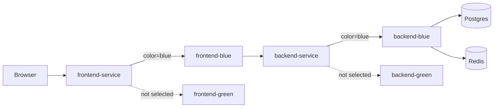
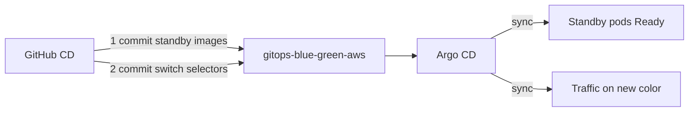

# Blue/green deployment (Kubernetes)

This project’s **default** path is a Kubernetes **rolling update**.  
**Blue/green** is an optional overlay: two full app slots (blue + green); only one receives traffic via Service selectors.

## Concept



| Slot | Role |
|------|------|
| **Blue** | One complete stack (frontend + backend Deployments) |
| **Green** | Identical stack, usually scaled to 0 until a release |
| **Active** | Color currently selected by `frontend-service` / `backend-service` |
| **Standby** | The other color — new version is deployed here first |

Cutover is a **selector flip** (milliseconds). Old pods stay until you scale them down (instant rollback if still running).

Postgres/Redis stay **shared** (not duplicated). Blue/green here is for the **stateless app tier**, not the database.

---

## Why not the default rolling update?

| Rolling update | Blue/green |
|----------------|------------|
| New pods replace old gradually | New version fully ready before any traffic |
| Brief mix of v1 + v2 | Instant switch; no mixed versions in live traffic |
| Rollback = roll forward to old image | Rollback = flip selector back (if old slot still up) |

---

## Files

| Path | Purpose |
|------|---------|
| `k8s/components/blue-green/` | Shared blue/green Deployments + active-color ConfigMap |
| `k8s/overlays/blue-green/` | Local overlay (on top of `local`) |
| `k8s/overlays/blue-green-production/` | Production/GHCR overlay (on top of `production`) |
| `k8s/overlays/blue-green-aws/` | AWS EKS overlay (on top of `aws-production`, ECR) |
| `patches/service-color-selector.yaml` | Services select `app.kubernetes.io/color` |
| `scripts/k8s-blue-green-*.sh` | Local bootstrap / deploy / switch / status |
| `scripts/k8s-cd-blue-green-*.sh` | CI/CD prepare + cluster deploy |
| `scripts/k8s-aws-blue-green-deploy.sh` | One-shot AWS EKS blue/green |

Pods keep `app.kubernetes.io/name: backend|frontend` so NetworkPolicies and PDBs still match. Extra label: `app.kubernetes.io/color: blue|green`.

---

## Quick start

```bash
# 1. Build images (same as normal local K8s)
npm run k8s:build

# 2. Install blue/green (replaces rolling backend/frontend Deployments)
npm run k8s:blue-green:bootstrap

# 3. Check which color is live
npm run k8s:blue-green:status
```

App URL (local LB): `http://localhost:8081`

### Ship a new version

```bash
# Build a new tag
IMAGE_TAG=local-v3 npm run k8s:build

# Deploy to standby only (traffic still on active)
npm run k8s:blue-green:deploy -- local-v3 local-v3

# Optional: probe standby backend
# kubectl port-forward -n enterprise-app deploy/backend-green 3001:3000
# curl http://localhost:3001/health

# Flip traffic to standby
npm run k8s:blue-green:switch
```

By default, switch **scales the previous color to 0**. Keep both up for faster rollback:

```bash
SCALE_DOWN_OLD=false npm run k8s:blue-green:switch
```

### Rollback

If the old color is still scaled up:

```bash
npm run k8s:blue-green:switch -- blue   # or green — the previous color
```

If it was scaled to 0, redeploy the old tag to standby, then switch:

```bash
npm run k8s:blue-green:deploy -- local-v2 local-v2
npm run k8s:blue-green:switch
```

---

## npm scripts

| Script | What it does |
|--------|----------------|
| `k8s:blue-green:bootstrap` | `kubectl apply -k` overlay; wait for DB jobs + active Deployments |
| `k8s:blue-green:deploy` | Set image + scale **inactive** slot; wait Ready |
| `k8s:blue-green:switch` | Patch Service selectors + ConfigMap; optional scale-down |
| `k8s:blue-green:status` | Show active color, Deployments, pods |
| `k8s:blue-green:manifests` | Print built YAML |

---

## How the switch works

Services normally matched only `app.kubernetes.io/name`. Blue/green adds color:

```yaml
selector:
  app.kubernetes.io/name: backend
  app.kubernetes.io/color: blue   # flipped to green on cutover
```

Nginx in the frontend still proxies to `backend-service:3000`. After the switch, that Service’s endpoints are only the new color’s pods — **no Ingress or DNS change**.

---

## Relationship to other overlays

| Overlay | Deploy style |
|---------|----------------|
| `local` / `production` / `aws-production` | Rolling update (default) |
| `blue-green` | Blue/green for local clusters |
| `blue-green-production` | Blue/green for GHCR / generic CD |
| `blue-green-aws` | Blue/green kubectl on **AWS EKS** |
| `gitops-blue-green-aws` | Blue/green via **Argo CD** (Git is source of truth) |

Do **not** run rolling and blue/green on the same cluster without cleaning up — they fight over backend/frontend Deployment names.

| Do not combine | With |
|----------------|------|
| `DEPLOY_K8S` | `DEPLOY_BLUE_GREEN` |
| `DEPLOY_AWS_EKS` | `DEPLOY_BLUE_GREEN_AWS` |
| `USE_ARGOCD_GITOPS_AWS` | `USE_ARGOCD_BLUE_GREEN_AWS` |
| `DEPLOY_BLUE_GREEN_AWS` | `USE_ARGOCD_BLUE_GREEN_AWS` |
`
To leave blue/green and return to rolling:

```bash
kubectl delete -k k8s/overlays/blue-green --ignore-not-found
# or: kubectl delete -k k8s/overlays/blue-green-production --ignore-not-found
# or: kubectl delete -k k8s/overlays/blue-green-aws --ignore-not-found
npm run k8s:deploy          # local
# npm run k8s:aws:deploy    # AWS rolling
```

---

## AWS EKS blue/green

Uses `k8s/overlays/blue-green-aws` (on top of `aws-production`):

- ECR images  
- No in-cluster Postgres/Redis (RDS + ElastiCache)  
- Backend color Deployments drop wait-init containers and get `REDIS_URL`

### Local / one-shot on EKS

```bash
aws eks update-kubeconfig --region us-east-1 --name enterprise-app-production
export IMAGE_TAG=<ecr-tag-or-sha>
npm run k8s:aws:blue-green
```

### CD

| Variable / input | Purpose |
|------------------|---------|
| `DEPLOY_BLUE_GREEN_AWS=true` | Auto blue/green on EKS each `main` push |
| **deploy_blue_green_aws** | Manual CD checkbox |
| `PUSH_ECR` / ECR job | Images mirrored before deploy (auto when AWS BG enabled) |

Same switch flags as generic blue/green (`BLUE_GREEN_SWITCH`, etc.).

---

## CI/CD (generic + AWS)

**CI** validates `blue-green`, `blue-green-production`, and `blue-green-aws`.

**CD** jobs:

| Job | Overlay | Registry |
|-----|---------|----------|
| **blue-green** | `blue-green-production` | GHCR |
| **blue-green-aws** | `blue-green-aws` | ECR |

---

## Argo CD blue/green (AWS)

Git is the source of truth for **images, replicas, and which color is live**.



### One-time setup

```bash
# Install Argo + blue/green Application (not rolling enterprise-app-aws)
ARGOCD_BLUE_GREEN=true npm run argocd:aws:apply
# or: npm run argocd:aws:blue-green
```

GitHub variables:

| Variable | Value |
|----------|--------|
| `USE_ARGOCD_BLUE_GREEN_AWS` | `true` |
| `PUSH_ECR` | `true` |

Do **not** also enable `USE_ARGOCD_GITOPS_AWS`, `DEPLOY_AWS_EKS`, or `DEPLOY_BLUE_GREEN_AWS`.

### CD flow

1. Mirror images to ECR  
2. `argocd-gitops-blue-green-aws-standby.sh` — set standby color images + replicas in Git  
3. Commit/push → Argo syncs standby  
4. Wait until standby Deployments are Ready — **on failure, auto-abort** (scale standby back to 0 in Git)  
5. Switch commit with **previous color kept up** (`SCALE_DOWN_OLD=false`)  
6. Verify Service selector + `/health` — **on failure, auto-rollback** traffic to previous color  
7. On success, scale previous color to 0  

Manual CD checkboxes: **gitops_blue_green_aws**, **rollback_blue_green_aws**.

### Auto-rollback (what it does / does not)

| Failure point | Auto action |
|---------------|-------------|
| Standby never Ready / Argo sync Failed | Abort standby (replicas → 0); live traffic unchanged |
| Cutover verify fails (`/health` or Ready) | Rollback Git to previous color |
| DB migration already applied | **Not** undone — keep migrations backward-compatible |

Local / CLI:

```bash
npm run argocd:aws:blue-green:abort-standby   # after failed standby
npm run argocd:aws:blue-green:rollback        # flip traffic back
# then commit + push
```

### Files

| Path | Role |
|------|------|
| `k8s/overlays/gitops-blue-green-aws/` | Argo sync path |
| `k8s/argocd/applications/enterprise-app-aws-bg.yaml` | Application |
| `scripts/argocd-gitops-blue-green-aws-standby.sh` | Standby images |
| `scripts/argocd-gitops-blue-green-aws-switch.sh` | Traffic cutover in Git |
| `scripts/argocd-gitops-blue-green-aws-abort-standby.sh` | Abort failed standby |
| `scripts/argocd-gitops-blue-green-aws-rollback.sh` | Rollback traffic |

---

## Limitations (intentional)

- **Shared DB/Redis** — schema migrations must stay backward-compatible across the cutover window.
- **No HPA** on color Deployments in this overlay (fixed replicas; keeps the demo simple).
- **Not Argo Rollouts CRD** — blue/green is encoded in Git (Deployments + Service selectors), synced by Argo CD Applications.
- **Auto-rollback does not undo database schema** — only Git / traffic / replica state.
