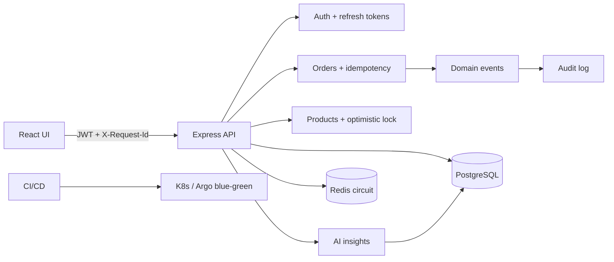

# Features Guide

This document explains **what the project does**, **why each feature exists**, and **how to demonstrate it** — for recruiters, hiring managers, and technical interviews.

For a 10-minute live walkthrough, see [DEMO.md](DEMO.md).  
For design-pattern file paths, see [ADVANCED_CONCEPTS.md](ADVANCED_CONCEPTS.md).

---

## Table of contents

1. [Product overview](#1-product-overview)
2. [Authentication & security](#2-authentication--security)
3. [Commerce (products & orders)](#3-commerce-products--orders)
4. [AI business assistant](#4-ai-business-assistant)
5. [Observability & API documentation](#5-observability--api-documentation)
6. [Advanced backend concepts](#6-advanced-backend-concepts)
7. [Data & Node.js runtime](#7-data--nodejs-runtime)
8. [Frontend (React)](#8-frontend-react)
9. [DevOps & platform](#9-devops--platform)
10. [Quality gates (tests & CI)](#10-quality-gates-tests--ci)
11. [How features work together](#11-how-features-work-together)
12. [Quick demo checklist](#12-quick-demo-checklist)

---

## 1. Product overview

**Enterprise Advanced App** is a full-stack TypeScript monorepo that looks like a small production commerce + ops platform:

| Layer | Technology |
|-------|------------|
| API | Node.js, Express, TypeScript |
| UI | React + Vite |
| Database | PostgreSQL (advanced SQL) |
| Cache | Redis (optional, graceful if down) |
| Deploy | Docker, Kubernetes, AWS (Terraform), Argo CD, blue/green |

**Default login:** `admin@enterprise.local` / `Password123!`  
**Roles:** `admin`, `manager`, `customer` (different screens and permissions).

---

## 2. Authentication & security

### User registration

- **What:** New users can create a customer account from the login screen.
- **API:** `POST /api/auth/register`
- **Why:** Shows complete auth lifecycle, not only a hardcoded demo user.
- **UI:** Login page → **Register** tab.

### Login (JWT access tokens)

- **What:** Email/password login returns a short-lived **access token** (default 15 minutes).
- **API:** `POST /api/auth/login`
- **Why:** Industry-standard API auth for SPAs and mobile clients.

### Refresh token rotation

- **What:** Long-lived **refresh token** is stored as a **SHA-256 hash** in Postgres. Each refresh **revokes** the old token and issues a new pair.
- **API:** `POST /api/auth/refresh`, `POST /api/auth/logout`
- **Why:** Limits damage if an access token leaks; stolen refresh tokens can be rotated/invalidated.
- **Docs:** [SECURITY.md](SECURITY.md)

### Role-based access control (RBAC)

- **What:** JWT carries `role`. Routes and UI menus check permissions.
- **Examples:** Only admin/manager see AI, Analytics, Audit; only admin deletes products.
- **Why:** Real multi-tenant / multi-role apps need this.

### Hardening

| Control | Purpose |
|---------|---------|
| Helmet | Secure HTTP headers |
| Rate limiting | Global + stricter auth endpoints |
| Zod validation | Reject bad payloads before business logic |
| Secrets via env | No hard-coded production secrets |

---

## 3. Commerce (products & orders)

### Product catalog

- **What:** List, search (PostgreSQL trigram similarity), and paginate products.
- **API:** `GET /api/products`, `GET /api/products/search?q=…`, `?page=&limit=`
- **Why:** Shows caching + search + pagination patterns recruiters expect.

### Product CRUD (admin / manager)

- **What:** Create, update, delete products from the UI.
- **API:** `POST /api/products`, `PATCH /api/products/:id`, `DELETE /api/products/:id`
- **Why:** Not read-only demo data — full resource lifecycle.
- **Extra:** Updates use **optimistic locking** (`version` / `expectedVersion`) so two editors cannot silently overwrite each other.

### Place order

- **What:** Create an order with one or more line items.
- **How:** Runs in a **database transaction**: lock product rows (`FOR UPDATE`), check stock, insert order + items, decrement stock.
- **API:** `POST /api/orders`
- **Why:** Demonstrates correctness under concurrency (classic interview topic).

### Cancel order + stock restore

- **What:** Cancel a pending/processing order; inventory is put back.
- **API:** `POST /api/orders/:id/cancel`
- **Why:** Shows compensating actions, not only “happy path” create.

### Idempotent order creation

- **What:** Client sends `Idempotency-Key` header. Retrying the same key returns the **same** order instead of creating a duplicate.
- **Why:** Network retries must not double-charge or double-decrement stock.
- **UI:** Orders page sends a unique key per place-order click.

### Audit trail

- **What:** Important actions (register, order create/cancel, product update) are recorded.
- **API:** `GET /api/audit` (admin/manager)
- **UI:** **Audit** page with filters.
- **Why:** Security and compliance story — “who did what, when.”

---

## 4. AI business assistant

### What it does

Managers/admins ask natural-language questions such as:

- “Which categories drive revenue?”
- “Do we have low-stock risks?”

The API answers using **live aggregates** from orders and products (not fake static text).

### Capabilities

| Feature | Endpoint | What it does |
|---------|----------|--------------|
| **Multi-turn chat** | `POST /api/ai/insights` | Question + optional `history` + `context` (`orders` / `products` / `general`) |
| **Summarize** | `POST /api/ai/summarize` | Executive summary of orders or catalog |
| **Recommend** | `POST /api/ai/recommend` | Product recommendations from stock/catalog data |
| **Provider strategy** | `DemoAiProvider` / `OpenAiProvider` | Swappable LLM backends |
| **Circuit fallback** | `aiCircuit` | OpenAI failures/open breaker → demo mode |

### Two modes

| Mode | When | Behavior |
|------|------|----------|
| **Demo** | No `OPENAI_API_KEY` | Rule-based insights from SQL snapshot (works offline for demos) |
| **OpenAI** | Key configured | LLM answer grounded in the same business JSON |

### Why it matters for hiring

Shows you can integrate AI **safely** (auth + RBAC + data grounding + optional circuit breaker fallback), not only call an API.

- **API:** `POST /api/ai/insights`, `/api/ai/summarize`, `/api/ai/recommend`
- **UI:** **AI Assistant** page (Chat / Summarize / Recommend tabs)

---

## 5. Observability & API documentation

### Health probes

| Endpoint | Meaning |
|----------|---------|
| `/health/live` | Process is up (liveness) |
| `/health` / `/health/ready` | DB (and Redis check) ready for traffic |

Used by Docker and Kubernetes.

### Prometheus metrics

- **Endpoint:** `/metrics`
- **What:** Request counts and latency histograms (`prom-client`).
- **Why:** Standard ops path for HPA / alerting conversations.

### OpenAPI + Swagger UI

- **UI:** http://localhost:3000/api/docs  
- **JSON:** `/api/openapi.json`  
- **How:** Generated from **Zod schemas** (`@asteasolutions/zod-to-openapi`) — same schemas used for request validation. No manual `openapi.json` to maintain.  
- **Why:** Contract-first API documentation hiring managers can click through.

### Structured logging

- Pino JSON logs; errors include **correlation ID** so you can find one request in log streams.

---

## 6. Advanced backend concepts

These are the “senior engineer” patterns. Full map: [ADVANCED_CONCEPTS.md](ADVANCED_CONCEPTS.md).

### Correlation IDs

Every request gets `X-Request-Id`. The same ID is available via **AsyncLocalStorage** and returned in error JSON as `correlationId`.

**Demo:** Call any API → check response headers; force an error → see matching ID in body.

### Circuit breaker

If Redis or OpenAI fails repeatedly, the breaker **opens** and the app fails fast or falls back (e.g. AI demo mode) instead of hanging.

**Demo:** System page → **Circuit breakers** panel.

### Domain events

Order created/cancelled, user registered, product updated emit in-process events. Handlers write the audit log — routes stay thin.

**Why:** Event-driven decoupling (same idea as Kafka/SNS, simplified for a portfolio).

### Feature flags

Env toggles:

```bash
FEATURE_AI_INSIGHTS=true
FEATURE_IDEMPOTENCY=true
FEATURE_CIRCUIT_BREAKER=true
FEATURE_DOMAIN_EVENTS=true
```

**Demo:** System page → **Feature flags**.

### Optimistic locking

Product updates increment `version`. Sending a stale `expectedVersion` returns `409 OPTIMISTIC_LOCK`.

### Result / Either type

Cache helpers return `{ ok: true, value }` or `{ ok: false, error }` so Redis outages do not crash the request path.

### Repository + Unit of Work

SQL lives in repositories; multi-step order logic uses `withTransaction` (atomic commit/rollback).

---

## 7. Data & Node.js runtime

### PostgreSQL advanced SQL

CTEs, window functions, JSONB, trigram search, row locks — see [DATABASE.md](DATABASE.md).

### Node cluster

Primary process forks workers to use multiple CPU cores — see [CLUSTER_AND_WORKERS.md](CLUSTER_AND_WORKERS.md).

### Worker Threads

CPU-heavy work can run off the event loop in isolated threads.

### Redis cache-aside

Product lists cached ~120s; writes invalidate cache. If Redis is down, API still serves from DB.

---

## 8. Frontend (React)

| Page | Who | Features shown |
|------|-----|----------------|
| Login / Register | Public | Auth UX |
| Dashboard | All | Health + orders summary |
| Products | All | Search, pagination; staff CRUD |
| Orders | All | Place / cancel / list |
| Analytics | Admin, manager | Advanced SQL analytics |
| AI Assistant | Admin, manager | Grounded AI Q&A |
| Audit | Admin, manager | Security event trail |
| System | Admin | Cluster info + advanced concepts |

Also: typed API client, role-based navigation, branded TypeScript patterns — see [TYPESCRIPT.md](TYPESCRIPT.md).

---

## 9. DevOps & platform

| Capability | What it proves |
|------------|----------------|
| Docker Compose | Local full stack |
| Kubernetes (Kustomize) | HPA, PDB, NetworkPolicy, Jobs, Ingress |
| Terraform | AWS VPC, EKS, RDS, ElastiCache, ECR |
| Argo CD GitOps | Git as source of truth |
| Blue/green + auto-rollback | Safe releases; abort standby / flip traffic back on failure |
| Document Lambda | API Gateway → Lambda → S3 upload path |

Guides: [KUBERNETES.md](KUBERNETES.md), [AWS_DEPLOYMENT.md](AWS_DEPLOYMENT.md), [ARGOCD.md](ARGOCD.md), [BLUE_GREEN.md](BLUE_GREEN.md), [CI_CD.md](CI_CD.md).

---

## 10. Quality gates (tests & CI)

| Gate | Purpose |
|------|---------|
| Vitest + Supertest | API tests (health, auth, products) |
| ESLint + TypeScript strict | Code quality |
| `npm audit` in CI | Dependency security |
| Dependabot | Automated dependency PRs |
| CI builds Docker + validates Kustomize + Terraform | Platform confidence |

---

## 11. How features work together



Example story you can tell in an interview:

> “A manager places an order with an Idempotency-Key. We open a transaction, lock stock, create the order, emit a domain event that writes the audit row, and return a correlation ID. If they retry the same key, they get the same response. Deployments to AWS use Argo CD blue/green with automatic rollback if the new color fails health checks.”

---

## 12. Quick demo checklist

Use after `npm run db:migrate && npm run db:seed` and `npm run dev` (or Docker).

| # | Action | Feature highlighted |
|---|--------|---------------------|
| 1 | Open `/api/docs` | OpenAPI |
| 2 | Login as admin | JWT + RBAC |
| 3 | Products → create/edit | CRUD + optimistic version |
| 4 | Orders → place + cancel | Transactions + stock restore |
| 5 | Repeat place with same Idempotency-Key (curl) | Idempotency |
| 6 | AI Assistant → ask about revenue | AI grounded in data |
| 7 | Audit page | Domain events → audit |
| 8 | System page | Correlation, flags, circuits |
| 9 | Open `/metrics` | Prometheus |
| 10 | Mention Argo blue/green docs | Platform / GitOps |

---

## Related documents

| Doc | Focus |
|-----|--------|
| [DEMO.md](DEMO.md) | 10-minute interview script |
| [ADVANCED_CONCEPTS.md](ADVANCED_CONCEPTS.md) | Pattern → file path map |
| [SECURITY.md](SECURITY.md) | Auth & hardening checklist |
| [API.md](API.md) | Endpoint reference |
| [ARCHITECTURE.md](ARCHITECTURE.md) | System architecture |
| [CI_CD.md](CI_CD.md) | Pipelines |

---

## Resume / LinkedIn blurb (optional)

> Built a production-style TypeScript commerce platform with JWT refresh rotation, idempotent orders, optimistic locking, domain events, AI insights grounded in live SQL, Prometheus metrics, OpenAPI, and AWS EKS delivery via Terraform, Argo CD, and blue/green auto-rollback.
