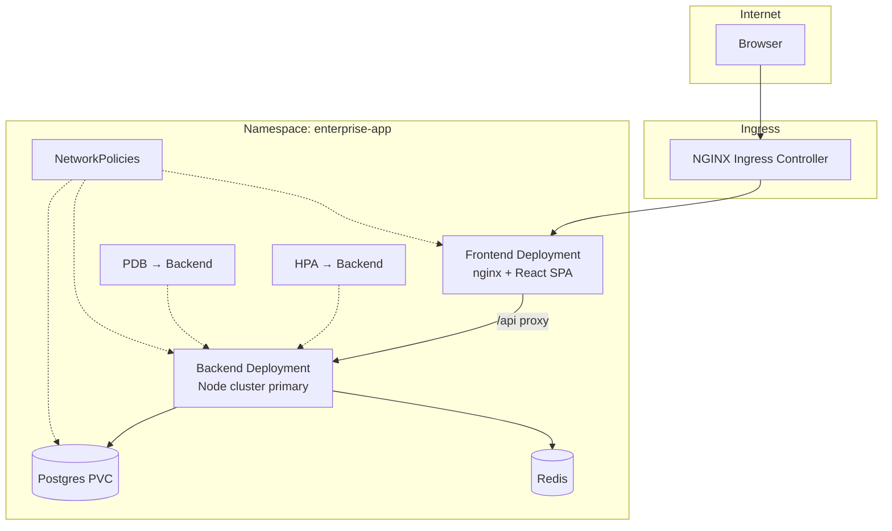

# Kubernetes Deployment Guide

This project includes a **production-oriented Kubernetes layout** using [Kustomize](https://kustomize.io/) (base + overlays), advanced workload patterns, and the same application architecture as Docker Compose.

## Table of contents

1. [Architecture on Kubernetes](#architecture-on-kubernetes)
2. [Directory layout](#directory-layout)
2b. **[Detailed deploy flow & file-by-file behaviour](KUBERNETES_DEPLOYMENT_FLOW.md)** ← start here for “how each file works”
2c. **[Blue/green deployment](BLUE_GREEN.md)** — optional color slots + Service cutover
3. [Advanced concepts used](#advanced-concepts-used)
4. [Prerequisites](#prerequisites)
5. [Quick start (local cluster)](#quick-start-local-cluster)
6. [Production overlay](#production-overlay)
7. [Operations](#operations)
8. [Scaling and resilience](#scaling-and-resilience)
9. [Security](#security)
10. [Troubleshooting](#troubleshooting)
11. [Production checklist](#production-checklist)

---

## Architecture on Kubernetes



### Traffic flow

1. User hits **Ingress** host `enterprise.local` (local) or `app.example.com` (production).
2. **frontend-service** (nginx) serves static files and proxies `/api/*` → **backend-service:3000**.
3. Each backend **Pod** runs `cluster/primary.js`, which forks `CLUSTER_WORKERS` Node workers (default **2** per pod).
4. **Horizontal Pod Autoscaler** scales backend pods on CPU/memory.
5. **Jobs** `db-migrate` and `db-seed` bootstrap the database (same images as the API).

This mirrors Docker Compose, but replaces Docker DNS with Kubernetes **Services** and adds autoscaling, disruption budgets, and network isolation.

---

## Directory layout

```
k8s/
├── base/                          # Shared manifests
│   ├── namespace.yaml
│   ├── configmap.yaml             # Non-secret env
│   ├── postgres-*.yaml
│   ├── redis-*.yaml
│   ├── backend-*.yaml             # Deployment, Service, HPA, PDB, SA
│   ├── frontend-*.yaml
│   ├── ingress.yaml
│   ├── networkpolicy.yaml
│   ├── migrate-job.yaml
│   ├── seed-job.yaml
│   └── kustomization.yaml
├── overlays/
│   ├── local/                     # Minikube / kind / Docker Desktop
│   │   ├── kustomization.yaml
│   │   ├── secrets.env            # Dev secrets (Kustomize generator)
│   │   └── patches/
│   └── production/                # GHCR images, TLS, higher replicas
│       ├── kustomization.yaml
│       ├── secrets.env.example
│       └── patches/
├── secrets.env.example
docker/
├── nginx.k8s.conf                 # Proxies to backend-service (not "backend")
└── frontend.k8s.Dockerfile
scripts/
├── k8s-build-images.sh
└── k8s-deploy-local.sh
```

---

## Advanced concepts used

| Concept | Resource | Purpose |
|---------|----------|---------|
| **Kustomize base + overlays** | `kustomization.yaml` | Same app, different env (local vs prod) without duplicating YAML |
| **Secret generation** | `secretGenerator` | Build `app-secrets` from `secrets.env` at deploy time — no secrets in git (prod) |
| **Init containers** | Backend Deployment | Wait for Postgres/Redis before starting API |
| **Probes** | All app Deployments | `readiness` (traffic) + `liveness` (restart) on `/health` or DB checks |
| **Resource requests/limits** | All containers | Schedulers place pods correctly; cap noisy neighbors |
| **HPA v2** | `backend-hpa` | Scale 2–8 pods on CPU (70%) and memory (80%) with scale behavior |
| **PodDisruptionBudget** | `backend-pdb` | Keep ≥1 backend pod during node drains / upgrades |
| **NetworkPolicy** | 3 policies | Backend only talks to Postgres/Redis; frontend only to backend |
| **ServiceAccount** | `backend` | Dedicated identity; `automountServiceAccountToken: false` |
| **Security context** | Backend/frontend | `runAsNonRoot`, drop `ALL` capabilities |
| **PVC** | `postgres-data` | Persistent database storage |
| **Batch Jobs** | `db-migrate`, `db-seed` | One-shot schema + seed (CI/CD hook-friendly) |
| **Ingress** | `enterprise-ingress` | Single host → frontend; TLS patch in production |
| **preStop hook** | Backend | 5s sleep for graceful connection drain |
| **Recreate strategy** | Postgres | Safe single-replica DB with RWO volume |

### Two levels of “workers”

Do not confuse:

1. **Kubernetes Pods** — horizontal scale (HPA adds more backend pods).
2. **Node.js cluster workers** — `CLUSTER_WORKERS` per pod (in-process fork).

Total Node HTTP workers ≈ **`replicas × CLUSTER_WORKERS`**. Tune `DB_POOL_MAX` so  
`replicas × CLUSTER_WORKERS × DB_POOL_MAX` does not exceed Postgres `max_connections`.

---

### Replica counts (by overlay)

| Service | `base/` | `overlays/local` | `overlays/production` | Notes |
|---------|---------|------------------|------------------------|-------|
| **backend** | 2 | 2 (HPA 2–4) | 3 (HPA 3–12) | Scales with HPA |
| **frontend** | 2 | 2 | 2 | nginx + static SPA |
| **postgres** | 1 | 1 | 1 | **Must stay 1** — single RWO PVC |
| **redis** | 2 | 2 | 2 | 2 pods; shared cache needs Redis Cluster in prod |

Change replicas in `k8s/overlays/local/patches/replicas.yaml`, then:

```bash
kubectl apply -k k8s/overlays/local
```

---

## Prerequisites

- Kubernetes **1.27+** (Minikube, kind, Docker Desktop Kubernetes, or a cloud cluster)
- `kubectl` configured for your cluster
- **NGINX Ingress Controller** (for Ingress)
- **metrics-server** (for HPA — install on Minikube: `minikube addons enable metrics-server`)
- Docker (to build images)

### Minikube example

```bash
minikube start --cpus=4 --memory=8192
minikube addons enable ingress
minikube addons enable metrics-server
eval $(minikube docker-env)   # build images inside Minikube's Docker
```

### kind example

```bash
kind create cluster
kubectl apply -f https://raw.githubusercontent.com/kubernetes/ingress-nginx/main/deploy/static/provider/kind/deploy.yaml
# After build: kind load docker-image enterprise-backend:local enterprise-frontend:local
```

---

## Quick start (local cluster)

### 1. Build images

```bash
# Minikube: run eval $(minikube docker-env) first
npm run k8s:build
```

This builds:

- `enterprise-backend:local` — `docker/backend.Dockerfile`
- `enterprise-frontend:local` — `docker/frontend.k8s.Dockerfile` (uses `backend-service` DNS name)

### 2. Configure secrets

Local overlay includes dev `secrets.env`. To customize:

```bash
cp k8s/secrets.env.example k8s/overlays/local/secrets.env
```

### 3. Preview manifests

```bash
npm run k8s:manifests
# or: kubectl kustomize k8s/overlays/local
```

### 4. Deploy

```bash
npm run k8s:deploy
```

The script applies manifests, waits for Postgres, migrate/seed jobs, and backend rollout.

### 5. Access the app

After deploy, open **http://localhost:8081** — same port as Docker Compose.

The **local overlay** patches `frontend-service` as `LoadBalancer` with `port: 8081` → pod port `80`. On **Docker Desktop Kubernetes** this maps to `localhost:8081` automatically (no `kubectl port-forward`).

```bash
kubectl get svc frontend-service -n enterprise-app
# EXTERNAL-IP should show localhost (Docker Desktop) or <pending> (Minikube)
```

**Minikube:** run `minikube tunnel` in another terminal if `EXTERNAL-IP` stays `<pending>`.

**Optional — Ingress** (`enterprise.local`): install NGINX Ingress Controller and add `127.0.0.1 enterprise.local` to your hosts file.

**Login:** `admin@enterprise.local` / `Password123!`

### 6. Tear down

```bash
npm run k8s:delete
kubectl delete pvc postgres-data -n enterprise-app   # optional: wipe DB
```

---

## Production overlay

Edit `k8s/overlays/production/kustomization.yaml`:

1. Set **GHCR image** names from CD pipeline (`ghcr.io/<owner>/<repo>/backend:latest`).
2. Copy secrets: `cp k8s/overlays/production/secrets.env.example k8s/overlays/production/secrets.env` (gitignored).
3. Patch Ingress host/TLS in `patches/ingress-production.yaml` (`app.example.com`, cert-manager).

Deploy:

```bash
kubectl apply -k k8s/overlays/production
```

For real production, prefer **managed PostgreSQL** and **managed Redis** — remove in-cluster Postgres/Redis Deployments and point `DATABASE_URL` / `REDIS_URL` in secrets at external endpoints.

---

## Operations

### Useful commands

```bash
# Pods and status
kubectl get all -n enterprise-app

# Backend logs (any pod)
kubectl logs -l app.kubernetes.io/name=backend -n enterprise-app -f

# Re-run migration after schema change
kubectl delete job db-migrate -n enterprise-app --ignore-not-found
kubectl apply -k k8s/overlays/local
kubectl wait --for=condition=complete job/db-migrate -n enterprise-app

# Scale backend manually (HPA will adjust within min/max)
kubectl scale deployment/backend -n enterprise-app --replicas=4

# HPA status
kubectl get hpa -n enterprise-app
```

### Rolling updates

Change image tag in overlay `images:` section, then:

```bash
kubectl apply -k k8s/overlays/local
kubectl rollout status deployment/backend -n enterprise-app
```

### Blue/green (optional)

For zero-downtime cutover with two color slots (blue/green) and a Service selector flip, see **[BLUE_GREEN.md](BLUE_GREEN.md)**.

```bash
npm run k8s:blue-green:bootstrap
npm run k8s:blue-green:deploy -- local-v3 local-v3
npm run k8s:blue-green:switch
```

### Connect CD pipeline to Kubernetes

Images published by [CI/CD](CI_CD.md) to GHCR:

```
ghcr.io/<github_owner>/node_typescript_advance_app/backend:latest
ghcr.io/<github_owner>/node_typescript_advance_app/frontend:latest
```

Use GitOps (Argo CD, Flux) or `kubectl set image` in a deploy workflow after `docker push`.

---

## Scaling and resilience

### Horizontal Pod Autoscaler

`backend-hpa` targets the backend Deployment:

- **minReplicas:** 2 (local overlay: 1)
- **maxReplicas:** 8 (production: 12)
- **Metrics:** CPU 70%, memory 80%
- **behavior:** fast scale-up, slower scale-down (stabilization window)

Requires **metrics-server**. Verify:

```bash
kubectl top pods -n enterprise-app
```

### Pod Disruption Budget

`backend-pdb` ensures at least **1** backend pod during voluntary disruptions (node drain, cluster upgrade).

### Graceful shutdown

Backend `terminationGracePeriodSeconds: 30` and `preStop` sleep allow in-flight HTTP requests to finish before the pod terminates. Align load balancer / Ingress drain timeouts with this.

---

## Security

| Control | Implementation |
|---------|----------------|
| Secrets | Kustomize `secretGenerator` from env file; prod file not committed |
| Non-root containers | `runAsUser` 1001 (backend), 101 (nginx) |
| Capabilities | `drop: [ALL]` |
| Network segmentation | NetworkPolicies restrict east-west traffic |
| Service account | Dedicated `backend` SA without auto-mounted token |
| Ingress TLS | Production patch + cert-manager annotation |
| JWT | `JWT_SECRET` from secret (min 16 chars in app validation) |

**NetworkPolicy note:** Policies require a CNI that enforces them (Calico, Cilium, etc.). On Docker Desktop / some Minikube drivers they may be ignored — verify with your platform.

---

## Troubleshooting

| Symptom | Check |
|---------|--------|
| `secret "app-secrets" not found` | Overlay must set `namespace: enterprise-app` on `secretGenerator`. Delete stray secret: `kubectl delete secret app-secrets -n default --ignore-not-found`, then re-apply. |
| Frontend `Permission denied` on `/var/cache/nginx` | Fixed with `emptyDir` volumes — `kubectl rollout restart deployment/frontend -n enterprise-app` |
| Backend `CrashLoopBackOff` (503 on `/health`, `database: false`) | **DB_SSL** env `"false"` was parsed as `true` by Zod — fixed in `env.ts`. Rebuild with a **new image tag** (e.g. `local-v2`); Kubernetes caches `:local` by digest. |
| Backend not picking up new image | Change tag in `k8s/overlays/local/kustomization.yaml` or run `bash scripts/k8s-fix-redeploy.sh` |
| Backend `CrashLoopBackOff` (other) | `kubectl logs deployment/backend -n enterprise-app` — check `DATABASE_URL` and Postgres PVC password mismatch (delete PVC if DB was initialized without secrets) |
| Migrate job failed | `kubectl logs job/db-migrate -n enterprise-app` |
| 502 from Ingress | Frontend pods ready? `kubectl get pods -n enterprise-app` |
| HPA shows `<unknown>` | Install metrics-server |
| Image pull errors (local) | Build inside cluster Docker (`minikube docker-env`) or `kind load docker-image` |
| API 401 / can't login | Re-run seed job; ensure migrate completed first |
| NetworkPolicy blocks traffic | Temporarily remove `networkpolicy.yaml` from base `kustomization.yaml` to test |

### Validate manifests in CI

CI runs `kubectl kustomize` on both overlays — same check locally:

```bash
npm run k8s:manifests
```

---

## Production checklist

- [ ] Replace in-cluster Postgres/Redis with managed services (RDS, Cloud SQL, ElastiCache, etc.)
- [ ] Store secrets in **Sealed Secrets**, **External Secrets Operator**, or cloud secret manager
- [ ] Set strong `JWT_SECRET` and rotate periodically
- [ ] Enable **TLS** on Ingress (cert-manager or cloud LB)
- [ ] Tune `CLUSTER_WORKERS`, `DB_POOL_MAX`, HPA min/max for your CPU and DB limits
- [ ] Configure **backup** for Postgres PVC or managed DB
- [ ] Add **Prometheus** scraping (ServiceMonitor) and centralized logging
- [ ] Set **Pod Security Standards** / admission policies on the namespace
- [ ] Use **readiness** only after DB migration in new environments (init Job in deploy pipeline)
- [ ] Pin image digests instead of `:latest` for reproducible deploys

---

## Related documentation

- [Architecture overview](ARCHITECTURE.md)
- [Docker deployment](DOCKER.md)
- [Cluster & Worker Threads](CLUSTER_AND_WORKERS.md)
- [CI/CD pipeline](CI_CD.md)
