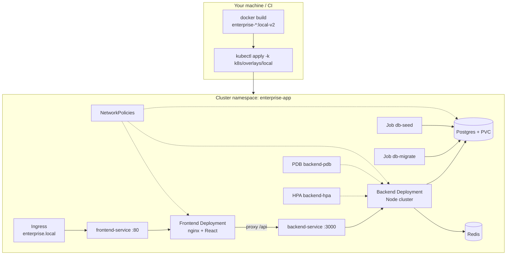
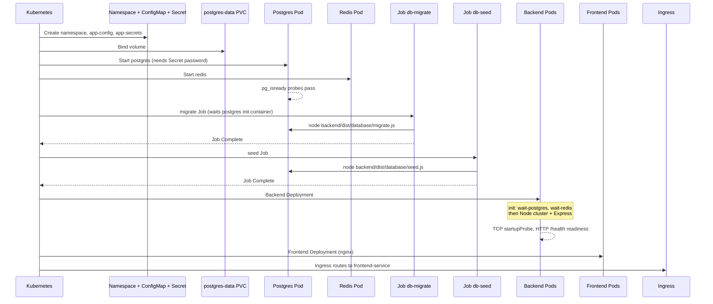
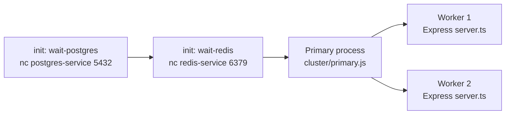
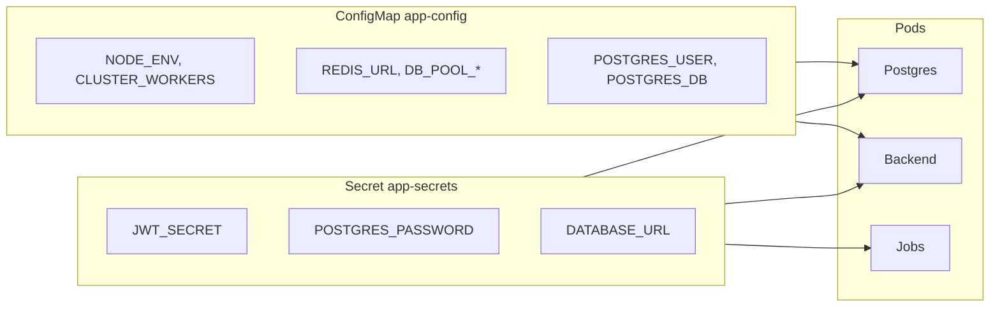

# Kubernetes deployment flow — detailed guide

This document explains **how deployment works end-to-end**, the **order things start**, and **what each file under `k8s/` does**. It complements the operational guide in [KUBERNETES.md](KUBERNETES.md).

---

## Table of contents

1. [Big picture](#1-big-picture)
2. [Folder layout (base vs overlays)](#2-folder-layout-base-vs-overlays)
3. [Deploy command flow](#3-deploy-command-flow)
4. [Runtime startup order (what happens after `kubectl apply`)](#4-runtime-startup-order-what-happens-after-kubectl-apply)
5. [HTTP request flow (user → app)](#5-http-request-flow-user--app)
6. [File-by-file reference](#6-file-by-file-reference)
7. [Scripts](#7-scripts)
8. [Environment and secrets](#8-environment-and-secrets)
9. [Scaling and failure behaviour](#9-scaling-and-failure-behaviour)

---

## 1. Big picture



**In one sentence:** You build Docker images, Kustomize merges YAML into one manifest set, Kubernetes creates objects in `enterprise-app`, Jobs prepare the database, then Deployments run the API and UI while Services and Ingress route traffic.

---

## 2. Folder layout (base vs overlays)

```
k8s/
├── base/                    # Shared manifests (all environments)
│   ├── kustomization.yaml   # Lists all base resources + default image names
│   ├── namespace.yaml
│   ├── configmap.yaml
│   ├── postgres-*.yaml
│   ├── redis-*.yaml
│   ├── backend-*.yaml
│   ├── frontend-*.yaml
│   ├── ingress.yaml
│   ├── networkpolicy.yaml
│   ├── migrate-job.yaml
│   └── seed-job.yaml
├── overlays/
│   ├── local/               # Dev cluster (Minikube, Docker Desktop, kind)
│   │   ├── kustomization.yaml   # namespace + secrets + patches + image tags
│   │   ├── secrets.env          # JWT, DB password, DATABASE_URL (not in git for prod)
│   │   └── patches/
│   └── production/          # GHCR images, TLS, more replicas
│       ├── kustomization.yaml
│       ├── secrets.env.example
│       └── patches/
├── secrets.env.example
└── README.md
```

| Layer | Role |
|-------|------|
| **base** | Defines the full app stack once. No secrets committed. |
| **overlay** | Adds environment-specific secrets, image tags, replica counts, Ingress host/TLS. |
| **Kustomize** | Merges base + overlay → single stream of YAML for `kubectl apply`. |

**Important:** Both `base/kustomization.yaml` and `overlays/*/kustomization.yaml` set `namespace: enterprise-app` so **every** object (including generated Secrets) lands in the same namespace.

---

## 3. Deploy command flow

What happens when you run:

```bash
bash scripts/k8s-build-images.sh
bash scripts/k8s-deploy-local.sh
```

### Step A — Build images (`scripts/k8s-build-images.sh`)

| Step | Action |
|------|--------|
| 1 | Build `enterprise-backend:local-v2` from `docker/backend.Dockerfile` (TypeScript → `dist/`, runs `cluster/primary.js`). |
| 2 | Build `enterprise-frontend:local-v2` from `docker/frontend.k8s.Dockerfile` (Vite build + nginx with `docker/nginx.k8s.conf`). |
| 3 | Optional: load images into Minikube/kind if you use those clusters. |

The **K8s frontend image** differs from Docker Compose: nginx proxies to **`backend-service`** (Kubernetes DNS name), not `backend`.

### Step B — Apply manifests (`scripts/k8s-deploy-local.sh`)

| Step | Action |
|------|--------|
| 1 | `kubectl apply -k k8s/overlays/local` — creates/updates all resources. |
| 2 | Verify `secret/app-secrets` exists in `enterprise-app`. |
| 3 | Delete old `db-migrate` / `db-seed` Jobs (Jobs are immutable; must recreate on re-deploy). |
| 4 | Re-apply + `rollout restart` for postgres/backend/frontend if needed. |
| 5 | Wait for Postgres → migrate Job → seed Job → backend → frontend. |

### What Kustomize does internally

```
overlays/local/kustomization.yaml
    ├── sets namespace: enterprise-app
    ├── includes ../../base (all base YAML)
    ├── secretGenerator → Secret app-secrets from secrets.env
    ├── patches → smaller replica counts, local Ingress host
    └── images → rewrites image tags to local-v2
         ↓
    kubectl apply receives ~20 objects
```

You can preview without applying:

```bash
kubectl kustomize k8s/overlays/local
```

---

## 4. Runtime startup order (what happens after `kubectl apply`)

Kubernetes does **not** follow the order in `kustomization.yaml` strictly, but **dependencies** produce this effective sequence:



### Phase 1 — Foundation (immediate)

| Resource | File | Behaviour |
|----------|------|-----------|
| **Namespace** | `base/namespace.yaml` | Creates isolated `enterprise-app` scope for all objects. |
| **ConfigMap** | `base/configmap.yaml` | Non-secret env: `NODE_ENV`, `CLUSTER_WORKERS`, `REDIS_URL`, pool sizes, etc. |
| **Secret** | Generated in overlay from `secrets.env` | `JWT_SECRET`, `POSTGRES_PASSWORD`, `DATABASE_URL`. |
| **PVC** | `base/postgres-pvc.yaml` | Requests 5Gi disk; Postgres data survives pod restarts. |

### Phase 2 — Data stores

| Resource | File | Behaviour |
|----------|------|-----------|
| **Postgres Deployment** | `base/postgres-deployment.yaml` | Single replica, `Recreate` strategy (safe with one RWO volume). Reads password from Secret. |
| **Postgres Service** | `base/postgres-service.yaml` | Stable DNS: `postgres-service:5432` inside the cluster. |
| **Redis Deployment/Service** | `base/redis-*.yaml` | Cache; backend degrades gracefully if Redis fails. |

### Phase 3 — Database bootstrap (Jobs)

| Resource | File | Behaviour |
|----------|------|-----------|
| **db-migrate** | `base/migrate-job.yaml` | Runs `node backend/dist/database/migrate.js` once. Applies SQL from `database/init/`. |
| **db-seed** | `base/seed-job.yaml` | Runs seed script (demo users/products/call_analytics). |

Jobs use the **same backend image** as the API but only run a single command, not the HTTP server.

### Phase 4 — Application tier

| Resource | File | Behaviour |
|----------|------|-----------|
| **Backend Deployment** | `base/backend-deployment.yaml` | See [Backend pod lifecycle](#backend-pod-lifecycle) below. |
| **Backend Service** | `base/backend-service.yaml` | ClusterIP `backend-service:3000` — target for nginx and Ingress health proxy. |
| **Frontend Deployment** | `base/frontend-deployment.yaml` | nginx serves React static files; proxies `/api` to backend Service. |
| **Frontend Service** | `base/frontend-service.yaml` | ClusterIP port 80 → Ingress backend. |

### Phase 5 — Traffic & policy (can exist before pods are ready)

| Resource | File | Behaviour |
|----------|------|-----------|
| **Ingress** | `base/ingress.yaml` + overlay patch | External HTTP entry (host `enterprise.local` locally). |
| **NetworkPolicy** | `base/networkpolicy.yaml` | Restricts which pods can talk to which ports. |
| **HPA** | `base/backend-hpa.yaml` | Scales backend Deployment on CPU/memory (needs metrics-server). |
| **PDB** | `base/backend-pdb.yaml` | Keeps ≥1 backend pod during node drains. |
| **ServiceAccount** | `base/backend-serviceaccount.yaml` | Identity for backend pods; token automount disabled for security. |

### Backend pod lifecycle

Inside each **backend** pod:



| Probe | Path / type | Purpose |
|-------|-------------|---------|
| **startupProbe** | TCP :3000 | Wait until something listens (cluster workers up). |
| **readinessProbe** | HTTP `/health` | DB + Redis check; pod receives Service traffic only when ready. |
| **livenessProbe** | TCP :3000 | Restart only if process is dead — not if DB is briefly slow. |
| **preStop** | `sleep 5` | Drain connections before pod termination. |

---

## 5. HTTP request flow (user → app)

### Path A — Via Ingress (typical local with addon)

```
Browser  →  Ingress (enterprise.local:80)
         →  Service frontend-service:80
         →  Pod nginx (frontend)
                 ├─ GET /           → static files (React)
                 ├─ GET /api/*      → proxy → backend-service:3000/api/*
                 └─ GET /health     → proxy → backend-service:3000/health
```

### Path A — LoadBalancer (local overlay, default)

```
Browser → localhost:8081
       → Service frontend-service (LoadBalancer, port 8081)
       → Pod nginx :80
```

Configured in `k8s/overlays/local/patches/frontend-service-expose.yaml`. No manual port-forward.

### Path B — Ingress (optional)

```
Browser → enterprise.local:80 → frontend-service → nginx
```

Requires Ingress Controller + hosts file entry.

### Path C — Port-forward (debug fallback only)

```bash
kubectl port-forward svc/frontend-service -n enterprise-app 8081:80
```

### Path D — Direct API (debug only)

```bash
kubectl port-forward svc/backend-service -n enterprise-app 3000:3000
```

Browser/curl talks to Express only — no React.

### DNS names pods use

| From | To | Name |
|------|-----|------|
| Frontend nginx | Backend | `http://backend-service:3000` |
| Backend | Postgres | `postgres-service:5432` (via `DATABASE_URL`) |
| Backend | Redis | `redis-service:6379` (via `REDIS_URL`) |
| Migrate/seed Job | Postgres | same `DATABASE_URL` in Secret |

---

## 6. File-by-file reference

### Root / shared

| File | Kind (conceptual) | Behaviour |
|------|-------------------|-----------|
| `k8s/README.md` | Doc pointer | Short link to guides. |
| `k8s/secrets.env.example` | Template | Copy to `overlays/local/secrets.env`; never commit real prod secrets. |

### `k8s/base/kustomization.yaml`

- Sets **`namespace: enterprise-app`** for all base resources.
- Lists resource files in apply order (informational; API server reconciles in parallel).
- Default image placeholders `enterprise-backend:latest` / `enterprise-frontend:latest` (overlays override tags).

### `k8s/base/namespace.yaml`

- Declares **`enterprise-app`** namespace and labels.

### `k8s/base/configmap.yaml` → `app-config`

| Key | Used by | Meaning |
|-----|---------|---------|
| `NODE_ENV` | Backend | `production` in cluster. |
| `CLUSTER_WORKERS` | Backend primary | Fork 2 Node workers per pod. |
| `REDIS_URL` | Backend | `redis://redis-service:6379`. |
| `DB_POOL_*`, `LOG_LEVEL`, etc. | Backend pool / logging | Tunables. |
| `POSTGRES_USER`, `POSTGRES_DB` | Postgres container | DB identity. |

Secrets **override** sensitive values (e.g. `DATABASE_URL` from Secret, not ConfigMap).

### `k8s/base/postgres-pvc.yaml`

- **PersistentVolumeClaim** `postgres-data`, 5Gi, ReadWriteOnce.
- Binds to Postgres pod volume at `/var/lib/postgresql/data`.

### `k8s/base/postgres-deployment.yaml`

- 1 replica, image `postgres:16-alpine`.
- `strategy: Recreate` — old pod must stop before new one mounts the same PVC.
- Env: user/db from ConfigMap, password from Secret.
- Probes: `pg_isready`.

### `k8s/base/postgres-service.yaml`

- ClusterIP service selector `app.kubernetes.io/name: postgres`.

### `k8s/base/redis-deployment.yaml` / `redis-service.yaml`

- Single Redis 7 instance for caching.
- No persistence in this demo (ephemeral cache).

### `k8s/base/backend-serviceaccount.yaml`

- ServiceAccount `backend` for backend pods.
- `automountServiceAccountToken: false` — pods don't need K8s API access.

### `k8s/base/backend-deployment.yaml`

- **Replicas:** 2 in base, patched to 1 in local overlay.
- **Image:** rewritten by overlay to `enterprise-backend:local-v2`.
- **initContainers:** block until Postgres and Redis ports accept connections.
- **envFrom:** all keys from `app-config`.
- **env:** `JWT_SECRET`, `DATABASE_URL` from Secret.
- **securityContext:** non-root UID 1001, drop capabilities.

### `k8s/base/backend-service.yaml`

- Selects pods `app.kubernetes.io/name: backend`.
- Port 3000 → container port `http`.

### `k8s/base/backend-hpa.yaml`

- Targets `Deployment/backend`.
- Scales between min/max replicas on CPU (70%) and memory (80%).
- Local overlay: min 1, max 4.

### `k8s/base/backend-pdb.yaml`

- `minAvailable: 1` during voluntary disruptions (node upgrade, `kubectl drain`).

### `k8s/base/frontend-deployment.yaml`

- nginx + static React build.
- **volumeMounts:** `emptyDir` for nginx cache/run (required for non-root).
- Probes: HTTP GET `/` on port 80.

### `k8s/base/frontend-service.yaml`

- Port 80 → frontend pods; Ingress backend.

### `k8s/base/ingress.yaml`

- `ingressClassName: nginx` (requires NGINX Ingress Controller).
- Routes `/` to `frontend-service:80`.
- Production overlay adds TLS + `app.example.com`.

### `k8s/base/networkpolicy.yaml`

Three policies:

| Policy | Pod | Allows |
|--------|-----|--------|
| `backend-network-policy` | backend | Ingress from frontend; egress to postgres, redis, DNS. |
| `postgres-network-policy` | postgres | Ingress from backend, migrate-job, seed-job only. |
| `frontend-network-policy` | frontend | Ingress on 80; egress to backend, DNS. |

**Implication:** ad-hoc `kubectl run` debug pods **cannot** reach Postgres unless they match allowed labels.

### `k8s/base/migrate-job.yaml`

- **Job** `db-migrate`, `ttlSecondsAfterFinished: 300` (auto cleanup).
- Command: `node backend/dist/database/migrate.js`.
- Only needs `DATABASE_URL` from Secret.

### `k8s/base/seed-job.yaml`

- **Job** `db-seed` after migrate.
- Command: `node backend/dist/database/seed.js`.
- Short init sleep so migrate usually finishes first (deploy script also waits).

### `k8s/overlays/local/kustomization.yaml`

| Feature | Behaviour |
|---------|-----------|
| `namespace: enterprise-app` | Ensures generated Secret is in the right namespace. |
| `secretGenerator` | Builds `app-secrets` from `secrets.env`. |
| `patches/replicas.yaml` | backend/frontend/redis = 2 pods; postgres = 1; HPA min 2. |
| `patches/frontend-service-expose.yaml` | `LoadBalancer` on port **8081** → pod :80 (auto `localhost:8081` on Docker Desktop). |
| `patches/ingress-local.yaml` | Host `enterprise.local`. |
| `images` | Tags `local-v2` for backend and frontend. |

### `k8s/overlays/local/secrets.env`

- `JWT_SECRET`, `POSTGRES_PASSWORD`, `DATABASE_URL` for local dev.
- Must match Postgres password and Service DNS names.

### `k8s/overlays/production/kustomization.yaml`

- Same structure; image names point to **GHCR**.
- Patches: more CPU/memory, replicas 3–12, TLS Ingress.
- `secrets.env` from example — not committed.

### Docker files used only for Kubernetes

| File | Role |
|------|------|
| `docker/backend.Dockerfile` | API image (same as Compose). |
| `docker/frontend.k8s.Dockerfile` | Frontend image using `nginx.k8s.conf`. |
| `docker/nginx.k8s.conf` | `proxy_pass http://backend-service:3000/api/`. |

---

## 7. Scripts

| Script | When to use | What it does |
|--------|-------------|--------------|
| `scripts/k8s-build-images.sh` | Before first deploy or after code changes | Builds `enterprise-backend:${TAG}` and `enterprise-frontend:${TAG}` (default `local-v2`). |
| `scripts/k8s-deploy-local.sh` | Normal deploy | `kubectl apply -k`, verify secret, recycle Jobs, wait for rollouts. |
| `scripts/k8s-fix-redeploy.sh` | Broken/stuck deploy | Removes stray default-namespace secret, optional PVC reset, rebuild, redeploy. |

`package.json` shortcuts (require npm): `k8s:build`, `k8s:deploy`, `k8s:manifests`, `k8s:delete`, `k8s:fix`.

---

## 8. Environment and secrets



**ConfigMap** = safe to version in git.  
**Secret** = generated from `secrets.env` at deploy time (local) or from your secret manager in production.

---

## 9. Scaling and failure behaviour

| Mechanism | File | Behaviour |
|-----------|------|-----------|
| **HPA** | `backend-hpa.yaml` | More backend **pods** when CPU/memory high. |
| **Node cluster** | `CLUSTER_WORKERS` in ConfigMap | More **processes per pod** (each pod = 1 primary + N workers). |
| **PDB** | `backend-pdb.yaml` | At least one backend pod during maintenance. |
| **Probes** | `backend-deployment.yaml` | Unready pods removed from Service; dead pods restarted. |
| **Job retry** | `migrate-job.yaml` | `backoffLimit: 5` on migration failures. |

**Connection math (important):**  
Approximate Postgres connections ≈ `backend_pods × CLUSTER_WORKERS × DB_POOL_MAX`. Keep below Postgres `max_connections`.

---

## Quick reference — apply order vs dependency order

| `kustomization.yaml` list order | Actually must be ready before |
|--------------------------------|------------------------------|
| namespace, configmap, secret | everything |
| pvc | postgres pod |
| postgres deployment/service | migrate job, backend init |
| redis | backend init |
| migrate job | seed job (recommended) |
| seed job | app login data |
| backend deployment | API traffic |
| frontend deployment | UI traffic |
| ingress | external access |
| networkpolicy, hpa, pdb | enforcement / scaling (parallel) |

---

## Related docs

- [KUBERNETES.md](KUBERNETES.md) — prerequisites, commands, troubleshooting  
- [ARCHITECTURE.md](ARCHITECTURE.md) — app layers, cluster vs worker threads  
- [DOCKER.md](DOCKER.md) — Compose equivalent (different nginx upstream name)
