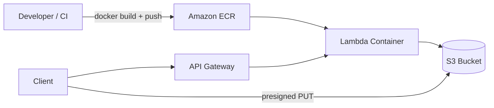

# Document Upload — AWS Lambda (Docker) + S3

Serverless document storage using **Lambda container image (Docker)**, **ECR**, **S3**, and **API Gateway**.

## Architecture



| Component | Purpose |
|-----------|---------|
| **Dockerfile** | Multi-stage build — compiles TypeScript, runs on `public.ecr.aws/lambda/nodejs:20` |
| **ECR** | Stores Lambda container image |
| **Lambda** | `package_type = Image` (not Zip) |
| **S3** | Private encrypted document storage |
| **API Gateway** | HTTPS API |

---

## Deploy with Terraform (Docker — default)

### Prerequisites

- Docker installed and running
- AWS CLI configured (`aws configure`)
- Terraform >= 1.5

### 1. Configure `terraform.tfvars`

```hcl
enable_documents_lambda         = true
documents_lambda_package_type = "Image"   # default
documents_lambda_image_tag    = "latest"
documents_max_upload_mb       = 10
```

### 2. Apply (builds Docker image, pushes to ECR, deploys Lambda)

```bash
cd terraform
terraform init
terraform apply
```

**What `terraform apply` does for Docker Lambda:**

1. Creates ECR repo: `enterprise-app-production/document-upload-lambda`
2. Runs `scripts/lambda-document-upload-docker-push.sh`:
   - `docker build --platform linux/amd64`
   - `docker push` to ECR
3. Creates Lambda with `image_uri` pointing to ECR
4. Creates S3 bucket + API Gateway

### 3. Get endpoints

```bash
terraform output documents_api_url
terraform output documents_lambda_image_uri
terraform output documents_lambda_ecr_url
```

---

## Manual Docker build & push

```bash
# After first terraform apply (creates ECR repo)
ECR_URL=$(cd terraform && terraform output -raw documents_lambda_ecr_url)
AWS_REGION=us-east-1 IMAGE_TAG=v1.0.0 ECR_REPOSITORY_URL="$ECR_URL" \
  bash scripts/lambda-document-upload-docker-push.sh

# Update Lambda to new tag (re-apply with tag or update in AWS console)
cd terraform
terraform apply -var="documents_lambda_image_tag=v1.0.0"
```

Or use npm:

```bash
export ECR_REPOSITORY_URL=$(cd terraform && terraform output -raw documents_lambda_ecr_url)
npm run lambda:documents:docker
```

---

## Dockerfile explained

```dockerfile
# Stage 1 — build TypeScript on Node 20 Alpine
FROM node:20-alpine AS builder
WORKDIR /app
COPY package.json ./
RUN npm install
COPY tsconfig.json ./
COPY src ./src
RUN npm run build          # esbuild → dist/index.js

# Stage 2 — AWS Lambda Node 20 runtime
FROM public.ecr.aws/lambda/nodejs:20
COPY --from=builder /app/dist/index.js ${LAMBDA_TASK_ROOT}/
CMD ["index.handler"]      # exports.handler in index.js
```

| Line | Why |
|------|-----|
| Multi-stage | Keeps final image small (no devDependencies) |
| `linux/amd64` | Lambda requires x86_64 (set in push script) |
| `LAMBDA_TASK_ROOT` | AWS base image path for handler code |
| `CMD ["index.handler"]` | Entry point for container Lambda |

---

## API endpoints

Base URL: `terraform output documents_api_url`

| Method | Path | Description |
|--------|------|-------------|
| `POST` | `/presign` | Presigned S3 upload URL (**recommended**) |
| `POST` | `/upload` | Direct upload (base64, ≤10 MB) |
| `GET` | `/documents` | List documents |
| `GET` | `/documents/{key}` | Presigned download URL |
| `DELETE` | `/documents/{key}` | Delete document |

### Presigned upload example

```bash
API=$(cd terraform && terraform output -raw documents_api_url)

# 1. Get presigned URL
RESP=$(curl -s -X POST "${API}/presign" \
  -H "Content-Type: application/json" \
  -d '{"filename":"report.pdf","contentType":"application/pdf"}')

UPLOAD_URL=$(echo "$RESP" | jq -r .uploadUrl)

# 2. Upload directly to S3
curl -X PUT "$UPLOAD_URL" \
  -H "Content-Type: application/pdf" \
  --data-binary @report.pdf
```

---

## Terraform module layout

```
terraform/modules/documents-lambda/
├── main.tf       # S3, ECR, null_resource (docker push), Lambda, API Gateway
├── variables.tf
└── outputs.tf

lambda/document-upload/
├── Dockerfile    # Multi-stage Docker build
├── src/index.ts  # Handler source
└── package.json
```

### Key Terraform resources

```hcl
# ECR repository for Lambda image
resource "aws_ecr_repository" "lambda_document_upload" { ... }

# Build + push on code changes
resource "null_resource" "lambda_docker_build_push" {
  provisioner "local-exec" {
    command = "... lambda-document-upload-docker-push.sh"
  }
}

# Lambda from container image (not Zip)
resource "aws_lambda_function" "document_upload" {
  package_type = "Image"
  image_uri    = "${ecr_repo}:latest"
}
```

---

## Zip vs Docker

| | Zip (legacy) | **Docker (default)** |
|--|--------------|----------------------|
| `documents_lambda_package_type` | `Zip` | `Image` |
| Build | `npm run zip` | `docker build` |
| Deploy artifact | `function.zip` | ECR image |
| Dependencies | Bundled by esbuild | In container image |
| Max size | 250 MB unzipped | 10 GB image |

Set `documents_lambda_package_type = "Zip"` in tfvars to use Zip deployment.

---

## Update Lambda after code change

```bash
# Option A — terraform apply (rebuilds if src/index.ts changed)
cd terraform && terraform apply

# Option B — manual push + apply with new tag
ECR_URL=$(terraform output -raw documents_lambda_ecr_url)
IMAGE_TAG=$(git rev-parse --short HEAD) \
  ECR_REPOSITORY_URL="$ECR_URL" \
  bash scripts/lambda-document-upload-docker-push.sh

terraform apply -var="documents_lambda_image_tag=$IMAGE_TAG"
```

---

## GitHub Actions (CI/CD)

### CI — validates Docker build on every PR

`.github/workflows/ci.yml` → **docker** job builds `lambda/document-upload/Dockerfile` (no push).

### CD — deploy on `main`

`.github/workflows/cd.yml` → **lambda-documents** job:

1. `docker build --platform linux/amd64`
2. `docker push` → ECR `document-upload-lambda:{git-sha}`
3. `aws lambda update-function-code`

**Enable auto-deploy** — GitHub → Settings → Variables:

| Variable | Value |
|----------|-------|
| `DEPLOY_LAMBDA_DOCUMENTS` | `true` |
| `PUSH_ECR` | `true` (also triggers Lambda job) |
| `AWS_REGION` | `us-east-1` |

**Secret:** `AWS_ROLE_ARN` (needs ECR push + `lambda:UpdateFunctionCode`)

**Manual:** Actions → CD → Run workflow → check **deploy_lambda_documents**

```bash
# Local equivalent
export IMAGE_TAG=$(git rev-parse HEAD)
npm run lambda:documents:deploy
```

See [CI_CD.md](CI_CD.md).

---

## Security

- S3 bucket is private (no public access)
- Presigned URLs expire (default 15 min)
- Content-type allowlist enforced
- Add API Gateway authorizer for production auth

---

## Tear down

```bash
aws ecr delete-repository \
  --repository-name enterprise-app-production/document-upload-lambda \
  --force

cd terraform
terraform destroy -target=module.documents_lambda
```
