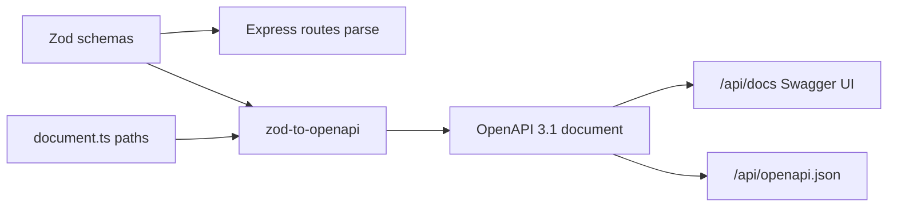

# OpenAPI / Swagger (auto-generated)

This project does **not** maintain a hand-written `openapi.json`.

## How it works

1. **Zod schemas** in [`schemas.ts`](../backend/src/openapi/schemas.ts) validate request bodies in routes **and** describe OpenAPI types.
2. **Paths** are registered in [`document.ts`](../backend/src/openapi/document.ts) with `@asteasolutions/zod-to-openapi`.
3. **Swagger UI** at `/api/docs` loads the document built at runtime by `getOpenApiDocument()`.
4. **Raw JSON** is still available at `/api/openapi.json` (generated, not edited).



## When you add a new endpoint

1. Add or reuse a Zod schema in `backend/src/openapi/schemas.ts`.
2. Use that schema in the route: `schema.parse(req.body)`.
3. Register the path in `backend/src/openapi/document.ts` with `registry.registerPath(...)`.
4. Restart the API — Swagger updates automatically.

Optional dump to disk:

```bash
npm install
npm run openapi:generate -w backend
# writes backend/src/openapi/openapi.generated.json (gitignored)
```

## Install note

Requires dependency `@asteasolutions/zod-to-openapi` (listed in `backend/package.json`).
