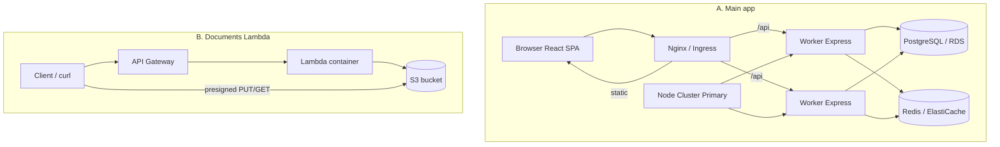
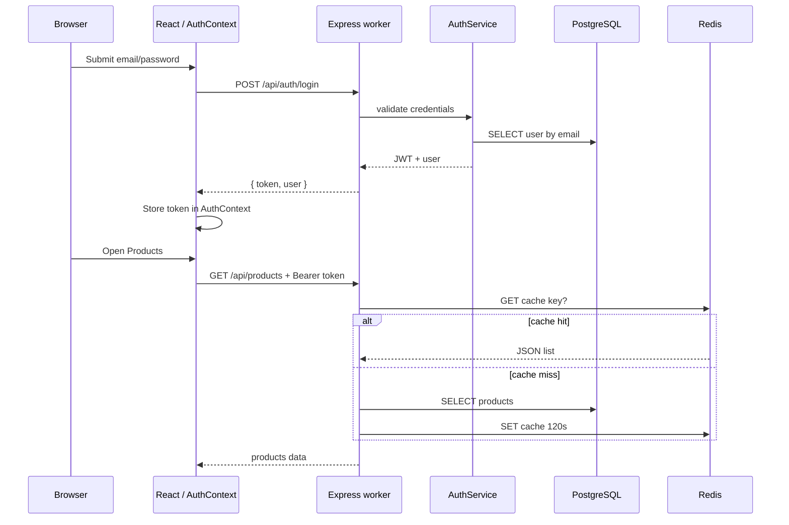
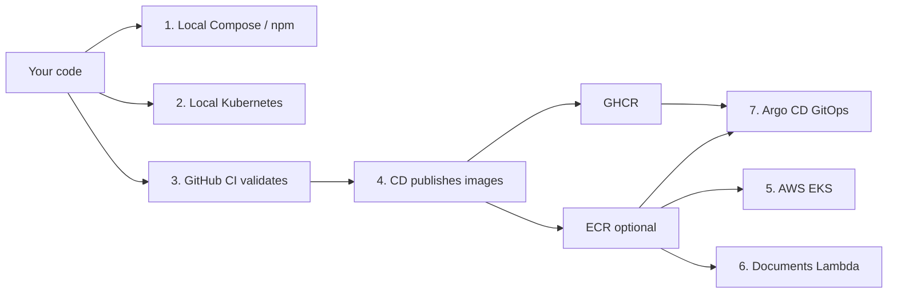
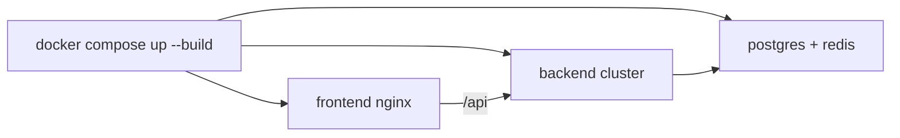
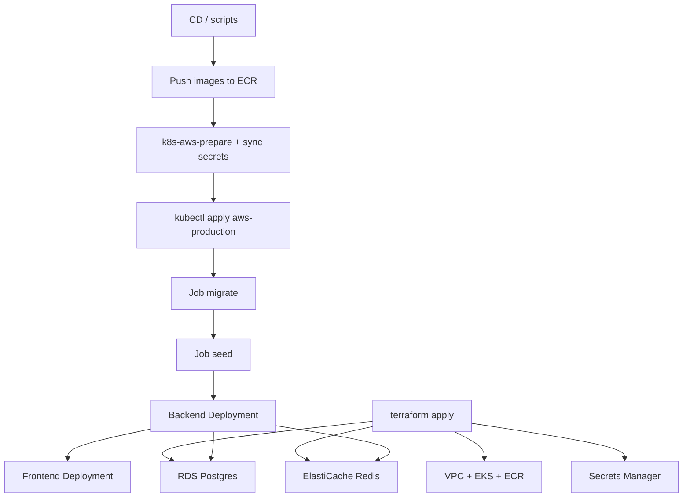
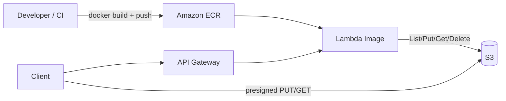
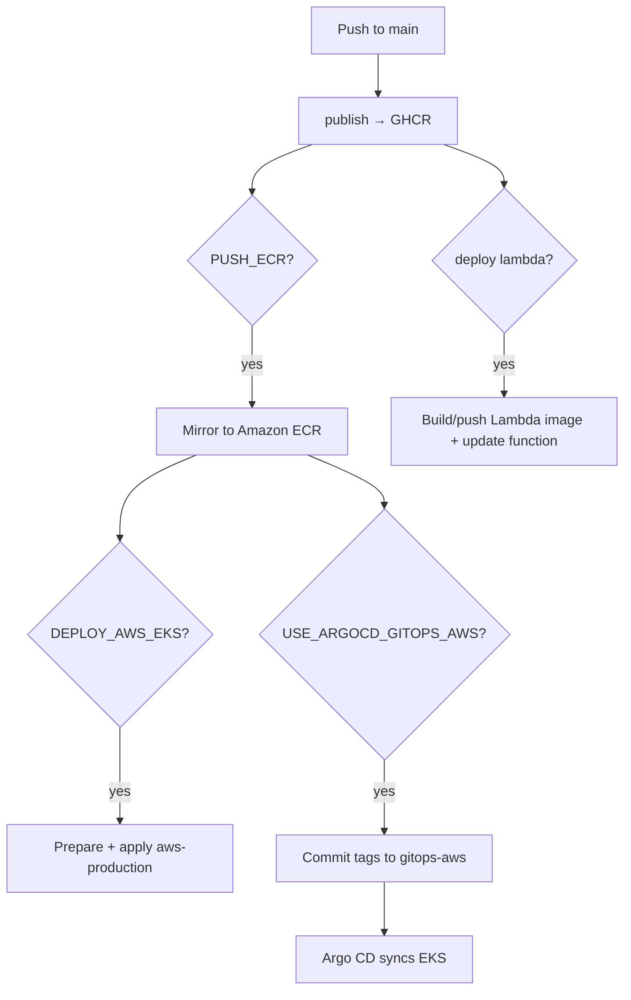

# Project Line-by-Line Guide — Features, Flows & Code

This document explains the **whole project**, the **request flow** (how a user action becomes a database query), and the **deployment flow** (how code reaches Docker / Kubernetes / AWS). It also includes line-by-line notes for important source files.

Related shorter docs: [ARCHITECTURE.md](ARCHITECTURE.md) · [LAMBDA_DOCUMENTS.md](LAMBDA_DOCUMENTS.md) · [KUBERNETES_DEPLOYMENT_FLOW.md](KUBERNETES_DEPLOYMENT_FLOW.md) · [CI_CD.md](CI_CD.md)

**Start here if you are new:** read §0 → §1 → §3 → §8, then the rest as needed.

---

## Table of contents

0. [Whole project explained (start here)](#0-whole-project-explained-start-here)
1. [Big picture](#1-big-picture)
2. [Feature map](#2-feature-map)
3. [Request flow (detailed)](#3-request-flow-detailed)
4. [Backend — cluster & server (line by line)](#4-backend--cluster--server-line-by-line)
5. [Backend — Express app & API routes](#5-backend--express-app--api-routes)
6. [Frontend flow](#6-frontend-flow)
7. [Database & Redis flow](#7-database--redis-flow)
8. [Deployment flow (detailed)](#8-deployment-flow-detailed)
9. [Document upload Lambda — full line-by-line](#9-document-upload-lambda--full-line-by-line)
10. [LAMBDA_DOCUMENTS.md section map](#10-lambda_documentsmd-section-map)
11. [CI/CD flow](#11-cicd-flow)

---

## 0. Whole project explained (start here)

### What is this project?

**Enterprise Advanced App** is a full-stack monorepo that shows how a real company-style Node.js + TypeScript application is built and deployed. It is both a working app and a teaching template.

It includes:

| Piece | Technology | Job |
|-------|------------|-----|
| Web UI | React + Vite + TypeScript | Login, dashboard, products, analytics, system pages |
| API | Node.js Express (cluster mode) | Auth, products, orders, analytics, health |
| Database | PostgreSQL | Users, products, orders, audit, call analytics |
| Cache | Redis (optional) | Speed up product list; app still works if Redis is down |
| CPU work | Worker Threads | Heavy math without blocking HTTP |
| Packaging | Docker | Same images for local, CI, and cloud |
| Orchestration | Kubernetes (Kustomize) | Pods, Services, Ingress, Jobs, HPA |
| Cloud infra | Terraform on AWS | VPC, EKS, RDS, ElastiCache, ECR, Secrets |
| GitOps | Argo CD (optional) | Cluster syncs from Git image tags |
| Documents | Lambda + S3 + API Gateway | Separate serverless file upload/download |

### Folder map (what lives where)

```
node_typescript_advance_app/
├── frontend/          # React SPA (what the user sees)
├── backend/           # Express API (cluster + workers + SQL)
├── database/init/     # SQL schema for first Postgres start
├── docker/            # Dockerfiles + nginx configs
├── docker-compose.yml # One-command local full stack
├── k8s/               # Kubernetes base + overlays (local, prod, AWS, gitops)
├── terraform/         # AWS infrastructure as code
├── lambda/            # Document-upload Lambda (Docker image)
├── scripts/           # Deploy / build helper scripts
├── .github/workflows/ # CI (validate) + CD (publish / deploy)
└── docs/              # Guides (this file included)
```

### What the app can do (product features)

1. **Login** — email/password → JWT token; roles `admin`, `manager`, `customer`
2. **Products** — list, filter, fuzzy search (trigram)
3. **Orders** — create order with stock check inside a DB transaction
4. **Analytics** — sales rankings, user summaries, call analytics, CPU demo
5. **System** — show Node/cluster runtime info
6. **Documents (AWS)** — upload/list/download/delete files in S3 via Lambda

**Default seed login:** `admin@enterprise.local` / `Password123!`

### How the pieces talk (simple)

```
User browser
    │
    ▼
Frontend (React)
    │  HTTP /api/... + JWT
    ▼
Backend (Express workers)
    │
    ├──► PostgreSQL   (source of truth)
    └──► Redis        (cache, optional)

Separately (AWS only):
Client ──► API Gateway ──► Lambda ──► S3
```

### Two systems in one repo

| | Main app | Documents Lambda |
|--|----------|------------------|
| **Purpose** | Business UI + API | File storage API |
| **Runs on** | Docker / K8s / EKS | AWS Lambda |
| **Data** | Postgres + Redis | S3 |
| **Deployed by** | Compose / kubectl / Argo / CD | Terraform + Docker → ECR |

They do **not** share the same process. The main app does not call Lambda unless you wire that yourself later.

### Mental model in one paragraph

A developer writes TypeScript in `frontend/` and `backend/`. Locally they run Docker Compose (or npm + Postgres/Redis). CI builds and checks everything. CD publishes Docker images. On Kubernetes/AWS those images become Pods: nginx serves the React app and proxies `/api` to Node. Node uses a **primary process** that forks several **worker processes**; each worker runs Express. Heavy CPU work goes to **Worker Threads**. Postgres holds data; Redis caches. On AWS, Terraform creates the cluster and managed database; optionally a second path stores documents in S3 through Lambda.

---

## 1. Big picture

There are **two runtime systems** in this repo:

| System | Stack | Purpose |
|--------|--------|---------|
| **A. Main enterprise app** | React + Express + Postgres + Redis | Auth, products, orders, analytics, system info |
| **B. Documents Lambda** | API Gateway + Lambda (Docker) + S3 | Upload / list / download / delete files |



**In one sentence:** The main app is a clustered Node API + React UI on Docker/K8s/AWS; documents are a separate serverless path that stores files in private S3.

---

## 2. Feature map

### Main app features

| Feature | Where | Who can use it | What it does |
|---------|--------|----------------|--------------|
| Login / JWT | `POST /api/auth/login` | Everyone | Returns token + user; password bcrypt |
| Products list | `GET /api/products` | Public (API) | Lists products; Redis cache ~120s |
| Product search | `GET /api/products/search?q=` | Public | `pg_trgm` similarity search |
| Orders | `GET/POST /api/orders` | Authenticated | Transaction + stock lock `FOR UPDATE` |
| Sales analytics | `GET /api/analytics/*` | admin, manager | CTEs, windows, LATERAL |
| Call analytics | `POST /api/analytics/calls/*` | admin, manager | Bulk last-called / count |
| CPU compute | `POST /api/analytics/compute` | admin, manager | Worker Thread offload |
| System info | `GET /api/system/info` | Authenticated | Cluster / Node metadata |
| Health | `GET /health` | Load balancers | Liveness |

### Frontend pages

| Route | Page | Role gate |
|-------|------|-----------|
| `/login` | Login | Guest only |
| `/` | Dashboard | Any logged-in user |
| `/products` | Products | Any logged-in user |
| `/analytics` | Analytics | `can('analytics')` → admin/manager |
| `/system` | System | `can('system')` → admin |

### Documents Lambda features

| Method | Path | What it does |
|--------|------|--------------|
| `POST` | `/presign` | Returns S3 presigned PUT URL (recommended) |
| `POST` | `/upload` | Direct base64 upload through Lambda (≤10 MB) |
| `GET` | `/documents` | List objects under `documents/` |
| `GET` | `/documents/{key}` | Presigned download URL |
| `DELETE` | `/documents/{key}` | Delete object |
| `OPTIONS` | any | CORS preflight |

---

## 3. Request flow (detailed)

This section answers: **what happens when a user clicks something?**

### 3.1 End-to-end path (every layer)

```
┌─────────────┐
│   Browser   │  User opens app, clicks Login / Products / Orders
└──────┬──────┘
       │ 1. Load HTML/JS (React SPA)
       ▼
┌─────────────┐
│  Frontend   │  React page + AuthContext + api.client.ts
│  (React)    │  Builds HTTP request, attaches JWT if logged in
└──────┬──────┘
       │ 2. fetch('/api/...')
       ▼
┌─────────────┐
│ Nginx /     │  Dev: Vite proxy   |  Docker/K8s: nginx
│ Ingress     │  Static files for /* ; proxy /api/* → backend:3000
└──────┬──────┘
       │ 3. TCP to backend Service / container
       ▼
┌─────────────┐
│ Cluster     │  OS / Node cluster picks ONE worker process
│ Primary     │  (primary itself does not handle HTTP)
└──────┬──────┘
       │ 4. Request lands on Worker N
       ▼
┌─────────────┐
│ Express     │  Middleware chain (see below)
│ worker      │  → Route → Service → Repository
└──────┬──────┘
       │ 5. Data access
       ├──────────────────┐
       ▼                  ▼
┌─────────────┐    ┌─────────────┐
│ PostgreSQL  │    │ Redis       │
│ (truth)     │    │ (cache)     │
└─────────────┘    └─────────────┘
       │ 6. JSON response { data } or { error }
       ▼
   Back up the same path → React updates UI
```

### 3.2 Middleware order inside Express

Every API request on a worker runs through this order (`backend/src/app.ts`):

| Step | Middleware / layer | What it does |
|------|--------------------|--------------|
| 1 | `helmet` | Security HTTP headers |
| 2 | `cors` | Allow browser cross-origin calls |
| 3 | `compression` | Gzip responses |
| 4 | `express.json` | Parse JSON body |
| 5 | `pinoHttp` | Structured request log |
| 6 | `rateLimit` | Max 500 requests / 15 minutes |
| 7 | Route match | `/api/auth`, `/products`, `/orders`, `/analytics`, … |
| 8 | `authenticate` | Verify JWT (protected routes) |
| 9 | `requireRole` | admin / manager / customer gate |
| 10 | Handler → service → SQL | Business logic |
| 11 | `errorHandler` | Turn errors into `{ error: { code, message } }` |

### 3.3 Login → products (happy path)



**Plain English:**

1. User submits email/password on Login page.
2. Frontend calls `POST /api/auth/login`.
3. Backend checks bcrypt hash in `users` table.
4. Backend returns JWT + user object.
5. Frontend stores token in `AuthContext` (memory / session).
6. User opens Products; frontend calls `GET /api/products` with `Authorization: Bearer …`.
7. Backend checks Redis; on miss, queries Postgres and caches ~120 seconds.
8. React renders the product list.

### 3.4 Create order (transaction request flow)

```
1. Client POST /api/orders { items, shippingAddress }
2. Auth middleware verifies JWT → knows user id
3. Order service starts transaction (BEGIN)
4. INSERT order row
5. For each item:
   - SELECT product FOR UPDATE (row lock — prevents oversell)
   - Check stock
   - INSERT order_item
   - Decrement stock
6. Update order total + write audit_logs
7. COMMIT (or ROLLBACK on any error)
8. Return order JSON to frontend
```

### 3.5 CPU analytics (worker thread request flow)

```
HTTP POST /api/analytics/compute
  → Express route on a cluster worker
  → runCpuTask({ task: 'primes', limit: ... })
  → spawn Worker Thread (cpu-intensive.worker.ts)
  → thread runs CPU work (does not block other HTTP on that process)
  → postMessage(result)
  → HTTP 200 JSON to client
```

### 3.6 Request flow by environment

| Environment | How `/api` reaches Express |
|-------------|----------------------------|
| `npm run dev` | Vite proxies `/api` → `localhost:3000` |
| Docker Compose | Frontend nginx proxies `/api` → hostname `backend:3000` |
| Local / prod K8s | Ingress → `frontend-service` nginx → `backend-service:3000` |
| AWS EKS | Same as K8s, but DB/Redis are RDS + ElastiCache |

### 3.7 Documents Lambda request flow (separate)

```
Recommended upload:
  Client POST /presign { filename, contentType }
    → API Gateway → Lambda
    → Lambda returns uploadUrl (signed PUT, ~15 min)
Client PUT file bytes directly to S3 (not through Lambda)

Download:
  Client GET /documents/{key}
    → Lambda returns downloadUrl
  Client GET file from S3 using that URL
```

---

## 4. Backend — cluster & server (line by line)

### `backend/src/cluster/primary.ts`

| Lines | Code idea | Why it exists |
|-------|-----------|---------------|
| 1–5 | File comment | Documents that primary forks workers; does not serve HTTP itself |
| 6–9 | Imports `cluster`, `os`, `env`, `logger` | Cluster API + CPU count + config |
| 11 | `cluster.isPrimary` | True only in the parent process |
| 13–15 | If **not** primary → `import('../server.js')` | Child process path: start Express |
| 17 | `resolveWorkerCount()` | `CLUSTER_WORKERS` or number of CPUs |
| 19–26 | Log cpus / workers / env | Startup observability |
| 28–31 | `for` + `cluster.fork({ WORKER_ID })` | Spawn N workers; each gets an ID env var |
| 33–35 | `cluster.on('online')` | Confirm worker started |
| 37–42 | `cluster.on('exit')` | If crash (non-zero, not graceful), **fork replacement** |
| 44–53 | `shutdown(signal)` | Kill all workers on SIGTERM/SIGINT; exit after 5s |
| 55–56 | Register signal handlers | K8s / Docker stop sends SIGTERM |

**Flow:**

```
node primary.js
  └─ isPrimary?
       ├─ YES → fork N workers → wait / restart / shutdown
       └─ NO  → load server.js → listen on PORT
```

### `backend/src/server.ts`

| Lines | Code idea | Why it exists |
|-------|-----------|---------------|
| 4–9 | Import HTTP, env, app, logger, pool, redis | Worker dependencies |
| 11–12 | `createApp()` + `createServer(app)` | One Express app per worker process |
| 14–23 | `start()` — ping Redis | Soft-fail: app runs even if Redis is down |
| 25–30 | `server.listen(PORT)` | All workers share the same port (cluster load balance) |
| 33–43 | `shutdown()` | Close HTTP → end DB pool → disconnect Redis → exit; hard exit after 10s |
| 45–46 | SIGTERM / SIGINT | Graceful drain for rolling deploys |
| 48–51 | `start().catch` | Fatal if listen fails |

---

## 5. Backend — Express app & API routes

### `backend/src/app.ts` (middleware order matters)

| Lines | What | Why order matters |
|-------|------|-------------------|
| 19 | `helmet()` | Security headers first |
| 20 | `cors` | Allow browser origins |
| 21 | `compression()` | Gzip responses |
| 23–30 | Special route: call count with **100mb** JSON | Must register **before** global 1mb JSON parser |
| 32 | `express.json({ limit: '1mb' })` | Default body size for other routes |
| 33–38 | `pinoHttp` | Structured request logs; skip `/health` noise |
| 40–47 | Rate limit 500 / 15 min | Abuse protection |
| 49–53 | Mount route modules | `/api/auth`, products, orders, analytics + system |
| 55 | `errorHandler` | Last — catches thrown errors → JSON error shape |

### Layered call path (any authenticated API)`

```
Request
  → helmet / cors / compression / json / logger / rateLimit
  → authenticate (JWT)  [if protected]
  → requireRole(...)    [if role-gated]
  → route handler
  → service
  → repository / queries
  → PostgreSQL (and maybe Redis)
  → JSON { data: ... } or { error: { code, message } }
```

### API surface (quick reference)

See full examples in [API.md](API.md).

| Prefix | Auth | Notes |
|--------|------|-------|
| `/health` | No | LB probe |
| `/api/auth` | No (login) | Issues JWT |
| `/api/products` | Usually open | Cached list + search |
| `/api/orders` | Bearer | Own orders |
| `/api/analytics` | Bearer + admin/manager | SQL + worker threads |
| `/api/system` | Bearer | Runtime info |

---

## 6. Frontend flow

### Boot

```
main.tsx
  → React root
  → AuthProvider (AuthContext)
  → BrowserRouter
  → App.tsx routes
```

### `App.tsx` behaviour

1. `/login` — if already logged in, redirect `/`
2. All other routes wrap in `ProtectedRoute` — no user → `/login`
3. `Layout` builds nav from `can('analytics')` / `can('system')`
4. Pages: Dashboard, Products, Analytics, System

### API client (`frontend/src/services/api.client.ts`)

| Lines | What | Why |
|-------|------|-----|
| 3 | `BASE = VITE_API_BASE_URL ?? '/api'` | Dev: Vite proxy; Docker: nginx `/api` |
| 5–14 | `ApiClientError` | Typed HTTP failures |
| 23–56 | `apiRequest<T>` | Sets JSON + optional Bearer; parses `{ data }` or throws |
| 59–65 | `createApiClient(token)` | Fluent `get` / `post` bound to token |

**Request flow:**

```
Page → createApiClient(token).get('/products')
  → fetch('/api/products')
  → nginx or Vite proxy → backend
  → response.data typed as T
```

---

## 7. Database & Redis flow

### Schema (high level)

| Table | Role |
|-------|------|
| `users` | Auth, roles, JSONB `metadata` |
| `products` | Catalog, stock, JSONB `attributes` |
| `orders` / `order_items` | Purchases; generated `line_total` |
| `audit_logs` | Change history |
| `call_analytics` | Call CDR rows for bulk analytics |

Extensions: `uuid-ossp`, `pg_trgm`.

### Migrate / seed

```
Docker first start → database/init/*.sql (empty volume only)
Anytime           → npm run db:migrate  (schema_migrations table)
Anytime           → npm run db:seed     (idempotent ON CONFLICT)
K8s               → Jobs db-migrate then db-seed before/with deploy
```

### Redis

- Used for product list cache
- If ping fails at startup → log warning, continue without cache
- Cache miss = hit Postgres (correctness preserved)

---

## 8. Deployment flow (detailed)

This section answers: **how does code go from your laptop to a running app?**

### 8.1 Overview — choose a path



| Path | When to use | Command / trigger |
|------|-------------|-------------------|
| 1. Docker Compose | Daily learning / demo | `docker compose up --build -d` |
| 2. Local K8s | Learn Kubernetes | `npm run k8s:build` + `npm run k8s:deploy` |
| 3. CI | Every PR | Automatic on push/PR |
| 4. CD publish | Merge to `main` | Automatic → GHCR images |
| 5. AWS EKS | Cloud production | Terraform + CD / scripts |
| 6. Lambda docs | File storage API | Terraform + CD lambda job |
| 7. Argo CD | Git-driven prod | CD commits tags → Argo syncs |

### 8.2 Option A — Docker Compose (simplest)

**Flow:**

```
1. Copy .env.example → .env
2. docker compose up --build -d
3. Compose builds backend + frontend images
4. Starts containers: postgres, redis, backend, frontend
5. Postgres runs database/init SQL on first empty volume
6. Seed users/products (manual seed command if needed)
7. Open frontend URL → nginx → /api → backend → DB/Redis
```



| Port (typical) | Service |
|----------------|---------|
| 8081 | Frontend (nginx + React) |
| 3000 | Backend API |
| 5432 | Postgres |
| 6379 | Redis |

### 8.3 Option B — Local Kubernetes

**Flow:**

```
1. npm run k8s:build
     → docker build backend image
     → docker build frontend-k8s image (nginx → backend-service)

2. npm run k8s:deploy
     → kubectl apply -k k8s/overlays/local
     → creates namespace enterprise-app
     → ConfigMap + Secret
     → Postgres + Redis Deployments/Services/PVC
     → Jobs: db-migrate, then db-seed
     → Backend Deployment (cluster primary per pod)
     → Frontend Deployment
     → Ingress (e.g. enterprise.local)
     → HPA / PDB / NetworkPolicy
```

**Startup order after apply:**

```
Postgres Ready ──► Job db-migrate complete ──► Job db-seed
                                              │
                                              ▼
                                    Backend pods Ready
                                              │
                                              ▼
                                    Frontend pods Ready
                                              │
                                              ▼
                                    Ingress routes traffic
```

**HTTP path on K8s:**

```
Browser → Ingress → frontend-service (nginx)
                      ├─ /*        → React static files
                      └─ /api/*    → backend-service:3000
                                      └─ Node cluster workers
                                           ├─► Postgres
                                           └─► Redis
```

### 8.4 Option C — AWS EKS (full cloud)

**Phase 1 — Infrastructure (once):**

```
cd terraform
terraform init
terraform apply
  → VPC, subnets, security groups
  → EKS cluster + node groups
  → ECR repositories (backend, frontend-k8s, optional lambda)
  → RDS PostgreSQL
  → ElastiCache Redis
  → Secrets Manager (DATABASE_URL, REDIS_URL, JWT_SECRET)
  → Ingress controller pieces / related networking
  → optional documents Lambda + S3 + API Gateway
```

**Phase 2 — Application deploy:**

```
1. Build/push images to ECR (CD or manual)
2. bash scripts/k8s-aws-sync-secrets.sh
     → writes secrets.env from Secrets Manager
3. bash scripts/k8s-aws-prepare.sh
     → sets image tags in aws-production overlay
4. bash scripts/k8s-aws-deploy.sh  (or CD aws-kubernetes job)
     → kubectl apply -k k8s/overlays/aws-production
     → delete+recreate migrate/seed Jobs (Jobs are immutable)
     → wait migrate → wait seed
     → rollout backend → rollout frontend
```



**Important:** `aws-production` **does not** run Postgres/Redis inside the cluster. Backend connects to **RDS** and **ElastiCache**.

**Live traffic on AWS:**

```
Internet → NLB / Ingress
  → Frontend nginx (React)
  → /api → Backend pods (Node cluster)
       ├─► RDS PostgreSQL
       └─► ElastiCache Redis
```

### 8.5 Option D — Argo CD GitOps

Instead of CI running `kubectl apply`:

```
1. CD builds and pushes images (GHCR and/or ECR)
2. CD commits new image tags into:
     - k8s/overlays/gitops/        (GHCR, generic cluster)
     - k8s/overlays/gitops-aws/    (ECR, AWS EKS)
3. Argo CD watches the Git repo
4. Argo CD syncs the cluster to match Git
```

Do **not** enable both `DEPLOY_AWS_EKS=true` and `USE_ARGOCD_GITOPS_AWS=true` — pick one deploy model.

### 8.6 Option E — Documents Lambda deploy

```
1. terraform apply with enable_documents_lambda = true
     → ECR repo + S3 + IAM + Lambda + API Gateway
     → docker build/push of lambda/document-upload
2. Later code changes:
     → terraform apply  OR
     → CD job lambda-documents (docker push + update-function-code)
3. Clients call terraform output documents_api_url
```

### 8.7 Deployment checklist (from zero to AWS)

| Step | Action | Done when |
|------|--------|-----------|
| 1 | Run Compose locally | Login works at frontend URL |
| 2 | Understand request flow | Login + products return data |
| 3 | Try local K8s | Ingress serves app |
| 4 | Push repo to GitHub | CI green on PR |
| 5 | Merge to main | Images in GHCR |
| 6 | `terraform apply` | EKS nodes Ready; RDS available |
| 7 | Enable `PUSH_ECR` | Images in ECR |
| 8 | Deploy aws-production or Argo | App URL responds on AWS |
| 9 | Optional Lambda | `/presign` returns upload URL |

---

## 9. Document upload Lambda — full line-by-line

This is the system described in [LAMBDA_DOCUMENTS.md](LAMBDA_DOCUMENTS.md).

### 9.1 Architecture flow



**Recommended upload (presign):**

```
1. Client POST /presign { filename, contentType }
2. Lambda builds key documents/{uuid}-{safeName}
3. Lambda returns uploadUrl (signed PUT, ~15 min)
4. Client PUT file bytes directly to S3 (not through Lambda)
5. Later: GET /documents/{key} → downloadUrl → GET from S3
```

**Why presign?** Large files never pass through Lambda (size/cost/timeout limits).

### 9.2 Dockerfile (every line)

File: `lambda/document-upload/Dockerfile`

| Line | Code | Meaning |
|------|------|---------|
| 1 | Comment | Multi-stage: compile TS, run on Lambda base |
| 2 | `FROM node:20-alpine AS builder` | Build stage — small Node image named `builder` |
| 3 | `WORKDIR /app` | All following commands run in `/app` |
| 4 | `COPY package.json ./` | Copy deps manifest first (Docker layer cache) |
| 5 | `RUN npm install` | Install dependencies including esbuild |
| 6 | `COPY tsconfig.json ./` | TypeScript / build config |
| 7 | `COPY src ./src` | Handler source |
| 8 | `RUN npm run build` | Bundle → `dist/index.js` |
| 9 | (blank) | Separates stages |
| 10 | `FROM public.ecr.aws/lambda/nodejs:20` | **Runtime** stage — official Lambda Node 20 |
| 11 | `COPY --from=builder ... ${LAMBDA_TASK_ROOT}/` | Only the compiled JS into Lambda task root |
| 12 | `CMD ["index.handler"]` | AWS invokes `exports.handler` from `index.js` |

**Build platform:** push script uses `--platform linux/amd64` because Lambda x86_64 requires it (important on Apple Silicon / some WSL setups).

### 9.3 Handler `lambda/document-upload/src/index.ts`

#### Imports & config (lines 1–26)

| Lines | What | Detail |
|-------|------|--------|
| 1 | `randomUUID` | Unique object key per upload |
| 2–8 | S3 client commands | Put / Get / List / Delete |
| 9 | `getSignedUrl` | Create time-limited URLs |
| 10–13 | API Gateway v2 types | HTTP API event/result typing |
| 15 | `new S3Client({})` | Uses Lambda execution role credentials (no keys in code) |
| 16 | `DOCUMENTS_BUCKET_NAME` | Required env from Terraform |
| 17 | `PRESIGN_EXPIRES` | Default 900 seconds (15 min) |
| 18 | `MAX_UPLOAD_BYTES` | Default 10 MB for direct `/upload` |
| 19 | `UPLOAD_KEY_PREFIX` | Default `documents/` — namespace in bucket |
| 21–26 | `ALLOWED_CONTENT_TYPES` | Allowlist from env CSV |

#### Helpers (lines 28–57)

| Function | Lines | Behaviour |
|----------|-------|-----------|
| `json()` | 28–39 | Builds API Gateway response: status, CORS headers, JSON body |
| `sanitizeFilename()` | 41–43 | Strip unsafe chars; max 200 length — path traversal / injection guard |
| `buildObjectKey()` | 45–49 | `documents/[folder/]{uuid}-{safeName}` |
| `parseBody()` | 51–57 | Decode base64 if API GW encoded; `JSON.parse` |

#### `handlePresign` (lines 59–87)

| Step | Lines | Action |
|------|-------|--------|
| Parse body | 61–64 | filename, contentType, optional folder |
| Validate MIME | 66–68 | 400 if not allowlisted |
| Build key | 70 | Unique S3 key |
| Sign PUT | 71–77 | `PutObjectCommand` + `getSignedUrl` |
| Respond | 79–86 | `uploadUrl`, `key`, `expiresIn`, required headers |

#### `handleDirectUpload` (lines 89–120)

| Step | Lines | Action |
|------|-------|--------|
| Require `dataBase64` | 96–98 | 400 if missing |
| MIME check | 100–102 | Same allowlist |
| Decode + size | 104–107 | 413 if over max |
| `PutObject` | 109–117 | Bytes go **through** Lambda into S3 |
| 201 response | 119 | key, bucket, size |

Use only for small files; prefer `/presign`.

#### `handleList` (lines 122–139)

- `ListObjectsV2` with prefix `documents/`, max 100
- Maps to `{ key, size, lastModified }`

#### `handleDownload` (lines 141–155)

- Reads `pathParameters.proxy` (greedy path after `/documents/`)
- Rejects keys that do not start with `documents/`
- Returns presigned **GET** URL

#### `handleDelete` (lines 157–166)

- Same key validation
- `DeleteObjectCommand`
- `{ deleted: true, key }`

#### Router `handler` (lines 168–202)

| Lines | Match | Handler |
|-------|-------|---------|
| 170–171 | Read method + path | From API Gateway HTTP API |
| 173–175 | `OPTIONS` | CORS 204 |
| 177–178 | `POST /presign` | Presign |
| 181–182 | `POST /upload` | Direct upload |
| 185–186 | `GET /documents` | List |
| 189–190 | `GET /documents/...` | Download URL |
| 193–194 | `DELETE /documents/...` | Delete |
| 197 | else | 404 |
| 198–201 | catch | Log + 500 |

**Export name `handler` must match** Dockerfile `CMD ["index.handler"]`.

### 9.4 Terraform module flow (`terraform/modules/documents-lambda/`)

| Resource group | What it creates | Why |
|----------------|-----------------|-----|
| ECR repo + lifecycle | Image registry; keep last 10 tags | Docker Lambda package |
| `null_resource` docker push | On Dockerfile/src/package change → run push script | Automate image on `terraform apply` |
| S3 bucket | Versioned, AES256, public access blocked, CORS for PUT/GET | Private document store |
| IAM role + S3 policy | Lambda assume role; Put/Get/Delete/List on that bucket only | Least privilege |
| Lambda function | `package_type = Image`, env vars for bucket/limits | Runtime |
| API Gateway HTTP API | Routes → Lambda integration | Public HTTPS API |

**Apply flow:**

```
terraform apply
  1. Create ECR
  2. local-exec: docker build + push
  3. Create S3 + IAM + Lambda (image_uri)
  4. Create API Gateway routes
  5. Outputs: documents_api_url, ecr url, image uri
```

---

## 10. LAMBDA_DOCUMENTS.md section map

How to read the doc you have open (`docs/LAMBDA_DOCUMENTS.md`):

| Doc lines | Section | What it teaches |
|-----------|---------|-----------------|
| 1–3 | Title | Docker Lambda + S3 + API GW |
| 5–20 | Mermaid architecture | Dev→ECR→Lambda; Client→API→Lambda→S3; Client→presigned S3 |
| 22–29 | Component table | Dockerfile, ECR, Lambda Image, S3, API GW roles |
| 33–55 | Terraform deploy | Prerequisites + tfvars (`enable_documents_lambda`, Image type) |
| 57–73 | `terraform apply` steps | ECR → docker push script → Lambda → S3 → API → outputs |
| 77–95 | Manual docker push | Tag/push without full recreate; npm script |
| 99–122 | Dockerfile explained | Same as §9.2 above |
| 126–154 | API endpoints + curl | Presign then PUT example |
| 158–190 | Module layout + HCL snippets | Where Terraform resources live |
| 194–204 | Zip vs Docker | Legacy Zip vs default Image |
| 208–221 | Update after code change | apply vs manual tag |
| 225–257 | GitHub Actions | CI builds Dockerfile; CD pushes + `update-function-code` |
| 261–266 | Security | Private bucket, expiry, MIME allowlist, add authorizer later |
| 270–279 | Tear down | Delete ECR + terraform destroy target |

---

## 11. CI/CD flow

### CI (`ci.yml`) — every PR / push

```
npm install + build (backend + frontend)
  → Postgres service: migrate + seed
  → docker build (backend, frontend, frontend-k8s, lambda) — no push
  → kubectl kustomize overlays (local, production, aws-production, gitops)
  → terraform fmt/validate
```

### CD (`cd.yml`) — main / tags



| Toggle | Effect |
|--------|--------|
| `PUSH_ECR=true` | Mirror app images to ECR |
| `DEPLOY_AWS_EKS=true` | kubectl deploy to EKS |
| `USE_ARGOCD_GITOPS_AWS=true` | GitOps commit instead of kubectl |
| `DEPLOY_LAMBDA_DOCUMENTS=true` | Update documents Lambda image |

---

## Quick “where do I look?” index

| I want to understand… | Open this |
|------------------------|-----------|
| **Whole project (overview)** | **§0 in this file** |
| **Request flow** | **§3 in this file** |
| **Deployment flow** | **§8 in this file** |
| Cluster forking | `backend/src/cluster/primary.ts` |
| HTTP server lifecycle | `backend/src/server.ts` |
| Middleware & routes | `backend/src/app.ts` |
| Advanced SQL | `backend/src/database/queries/*.ts` |
| Worker threads | `backend/src/workers/` |
| React auth & pages | `frontend/src/App.tsx`, `context/AuthContext.tsx` |
| Typed API calls | `frontend/src/services/api.client.ts` |
| Compose stack | `docker-compose.yml` |
| K8s objects | `k8s/base/` + `docs/KUBERNETES_DEPLOYMENT_FLOW.md` |
| AWS infra | `terraform/` + `docs/AWS_DEPLOYMENT.md` |
| Documents Lambda code | `lambda/document-upload/src/index.ts` |
| Documents Lambda ops | `docs/LAMBDA_DOCUMENTS.md` |

---

## Default credentials (seed)

- **Email:** `admin@enterprise.local`
- **Password:** `Password123!`

---

*This guide is the long-form companion to the shorter topic docs under `docs/`. Prefer those for day-to-day commands; use this file when you need flow + line-level meaning.*
